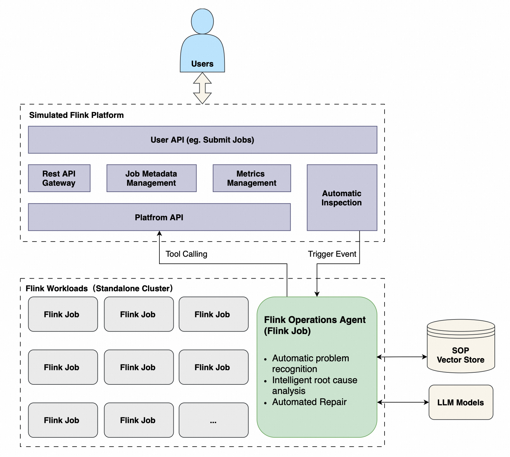
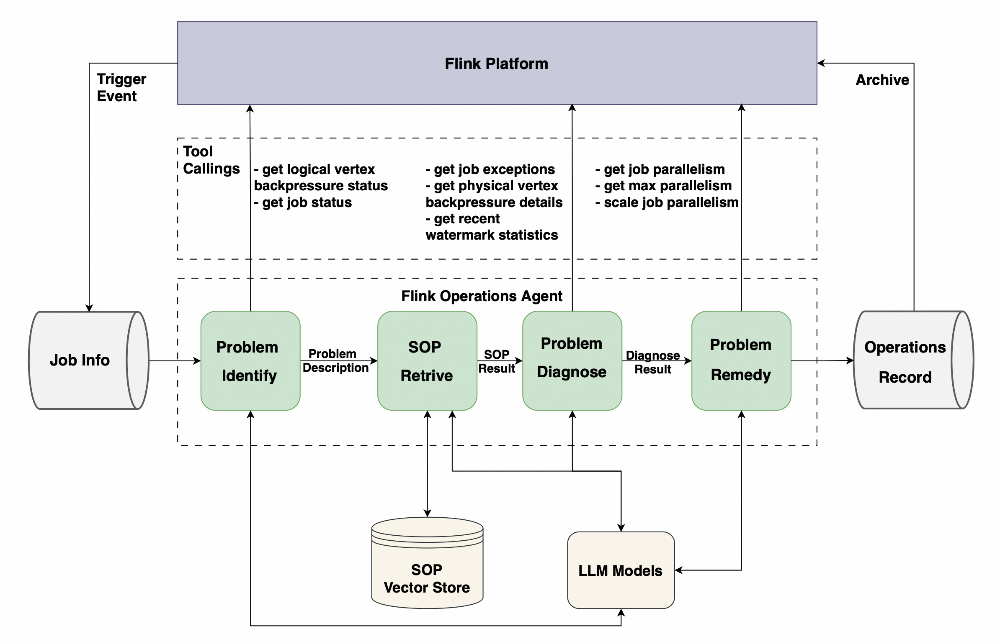

# Flink Operations Agent Demo

A demonstration project for Flink operations agent that automatically analyzes Flink job health, provides diagnostic recommendations, and can attempt to fix issues using available tools.

## Overview

This project showcases an intelligent Flink job operations system that:
- Detects Flink job health issues (backpressure, failures, etc.)
- Provides AI-powered diagnostic analysis and recommendations
- **Automatically attempts to fix issues** using available tools (restart jobs, adjust configurations, etc.)
- Integrates with Kafka for event streaming and Elasticsearch for SOP storage

### Architecture

<p align="center">
  
</p>

The architecture has two layers: a **Platform Layer** at the top, and a **Cluster Layer** at the bottom.

#### Cluster Layer

At the bottom sits a standalone Flink cluster running multiple jobs. What makes it special: an **Operations Agent** is also deployed here — running as a Flink job itself.

#### Platform Layer

At the top live the scripts that simulate platform capabilities. This is where users interact with the system — submitting jobs, managing them.

#### How the Two Layers Communicate

The Agent reaches up — calling tools, accessing the platform, gathering information, executing operations. The platform reaches down — triggering operation events, sometimes manually when a user requests it, sometimes automatically as part of routine inspections.

#### Inside the Agent: Three-Phase Pipeline

<p align="center">
  
</p>


When the Agent receives information about a Flink job, it runs through four phases:

1. **Problem Identification** — The Agent examines the job using fundamental information and universal knowledge. Is there an anomaly? If so, it moves to the next phase.

2. **SOP Retrieval** — The Agent searches the **SOP Vector Store** (Elasticsearch) for relevant experience and knowledge about this specific anomaly, using embedding similarity search to surface the most applicable procedures.

3. **Problem Diagnosis** — Armed with the retrieved SOPs, the Agent goes deeper. Multiple rounds of tool calls. Deep investigation and analysis using **LLM Chat Models** to determine: does this problem need fixing?

4. **Problem Remedy** — If it does, the Agent acts. Based on the diagnosis and the tools available, it either executes the fix automatically (e.g., restart jobs, adjust configurations) or surfaces what should be done.

Finally, the system outputs a complete **operations record** and feeds it back to the platform.

## Prerequisites

- **Docker**: For running Kafka and Elasticsearch
- **Ollama**: For generating embeddings (install from https://ollama.ai)
    - Required model: `nomic-embed-text:latest`
    - Run: `ollama pull nomic-embed-text:latest`
- **Python 3.10 or 3.11**: For PyFlink and operations agent
- **Java 11+**: For building and running Flink jobs
- **Maven**: For building sample jobs
- **curl**: For downloading dependencies
- **DashScope API Key**: For AI-powered diagnosis
    - Sign up at https://dashscope.aliyun.com
    - Set environment variable: `export DASHSCOPE_API_KEY=your_api_key_here`
    - If you prefer not to use Tongyi, you can modify the chat model section in `operations-agent-job/operations_agent.py`. We didn't use Ollama by default because smaller models have poor demo performance, while larger models run slowly on personal computers. For more chat model options, see the [Flink Agents Documentation](https://nightlies.apache.org/flink/flink-agents-docs-release-0.2/docs/development/chat_models/).


## Quick Start

### One-Command Setup

Start the entire demo environment with a single command:

```bash
./bin/start_all.sh
```

This script will automatically:
1. **Start Infrastructure** - Launch Kafka and Elasticsearch services
2. **Setup Flink Cluster** - Download, configure and start Flink with Flink-Agents
3. **Upload SOP Documents** - Index Standard Operating Procedures to Elasticsearch
4. **Submit Operations Agent** - Deploy the AI-powered operations agent job
5. **Submit Sample Jobs** - Create 4 demo jobs with different health states
6. **Auto-Send Job Info** - Start background process to trigger diagnosis every 3 minutes
7. **Consume Results** - Display diagnosis results in real-time (foreground process)

**Services Available:**
- Kafka: `localhost:9092`
- Elasticsearch: `localhost:9200`
- Flink Web UI: `localhost:8082`

**Operations Record:** Persisted to the `tmp/operations_record/` directory, classified by operational status:
- `normal/` - Jobs operating normally without anomalies
- `auto_remediated/` - Anomalies automatically remediated by the agent
- `manual_intervention/` - Anomalies requiring manual intervention

**Press Ctrl+C to stop the diagnosis result consumer** (other services continue running in background)

### Customization

#### Upload Custom SOPs

To add your own Standard Operating Procedures:

```bash
# 1. Add your SOP markdown files to the sop/ directory
# 2. Run the upload script
./bin/refresh_vector_store_sop.sh
```

#### Submit Custom Jobs

To submit your own Flink jobs with proper metadata tracking:

> **Why use this script?** This submission method saves job metadata (job ID, JAR ID, entry class, etc.) that enables the operations agent's tools to cancel and resubmit jobs automatically. This simulates production environment operations where jobs can be restarted with the same configuration and resources.

```bash
./bin/submit_custom_job.sh \
  -j /path/to/your-job.jar \
  -c com.your.package.YourJobClass \
  -p 4 \
  -n "My Custom Job"
```

Use `-h` flag for all available options: `./bin/submit_custom_job.sh -h`

## Project Structure

```
flink-operations-agent-demo/
├── bin/                             # User-facing scripts
│   ├── start_all.sh                 # One-command startup (starts all services + diagnosis consumer)
│   ├── stop_all.sh                  # One-command shutdown
│   ├── submit_custom_job.sh         # Submit custom Flink jobs
│   ├── refresh_vector_store_sop.sh  # Upload SOPs to Elasticsearch
│   └── internal/                    # Internal resources
├── operations-agent-job/            # Operations agent source code
│   ├── tools/                       # Tools for operations agent
│   ├── custom_types_and_prompts.py  # Custom types and prompts for diagnosis
│   ├── operations_agent.py          # Main agent logic
│   └── operations_agent_main.py     # Entry point
├── sample-jobs/                     # Sample Flink jobs
│   └── src/main/java/...            # Java job implementations
├── sop/                             # Standard Operating Procedures
│   ├── job_back_pressure.md         # Backpressure SOP
│   └── job_failed_to_start.md       # Failed startup SOP
├── tmp/                             # Runtime data (auto-generated, gitignored)
│   ├── job_metadata/                # Job metadata files
│   ├── metric_history/              # Metric history data
│   └── operations_record/           # Output files
├── docker-compose.yml               # Infrastructure services
└── README.md                        # This file
```

## Troubleshooting

### Services Not Starting

If services fail to start, check:
```bash
# Check Docker containers
docker ps -a

# Check Docker logs
docker logs kafka
docker logs elasticsearch

# Restart infrastructure
docker-compose down
./bin/setup_infra.sh
```

### Flink Cluster Issues

If Flink cluster has problems:
```bash
# Check Flink logs
tail -f flink-1.20.3/log/flink-*-standalonesession-*.log

# Restart Flink
flink-1.20.3/bin/stop-cluster.sh
./bin/setup_flink.sh
```

### Job Submission Failures

If job submission fails:
- Ensure Flink cluster is running: `http://localhost:8082`
- Check available task slots in Flink Web UI
- Verify virtual environment is activated: `source venv/bin/activate`
- Check job logs in Flink Web UI

### No Diagnosis Results

If diagnosis results are not generated:
- Verify operations agent job is running in Flink Web UI
- Check Kafka topics have messages: `docker exec kafka /opt/kafka/bin/kafka-console-consumer.sh --bootstrap-server localhost:9092 --topic operations_record --from-beginning`
- Ensure Elasticsearch is accessible: `curl http://localhost:9200`
- Verify SOPs are uploaded: `curl http://localhost:9200/my_documents/_count`
- Check Ollama is running: `curl http://localhost:11434/api/tags`
- Check agent job logs for errors

### Ollama Issues

If Ollama-related errors occur:
```bash
# Check if Ollama is running
curl http://localhost:11434/api/tags

# Pull the required embedding model
ollama pull nomic-embed-text:latest

# Verify model is available
ollama list | grep nomic-embed-text
```

## Cleanup

To stop all services and clean up:

```bash
# Stop all services
bin/stop_all.sh

# Optional: Remove downloaded files
rm -rf flink-1.20.3 flink-1.20.3-bin-scala_2.12.tgz
rm -rf venv
rm -f flink_agents-0.2.0-py3-none-any.whl
```

## License

Licensed under the Apache License, Version 2.0.
