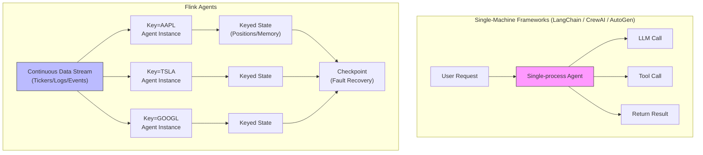
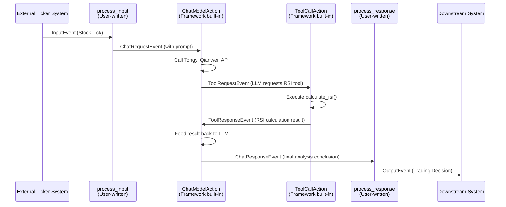
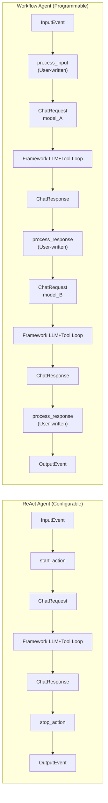
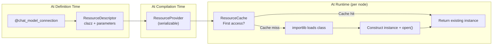
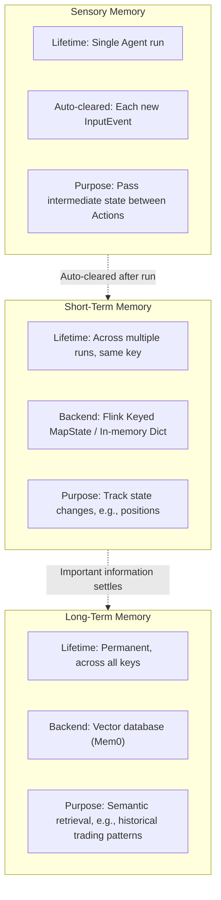
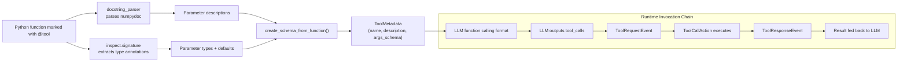
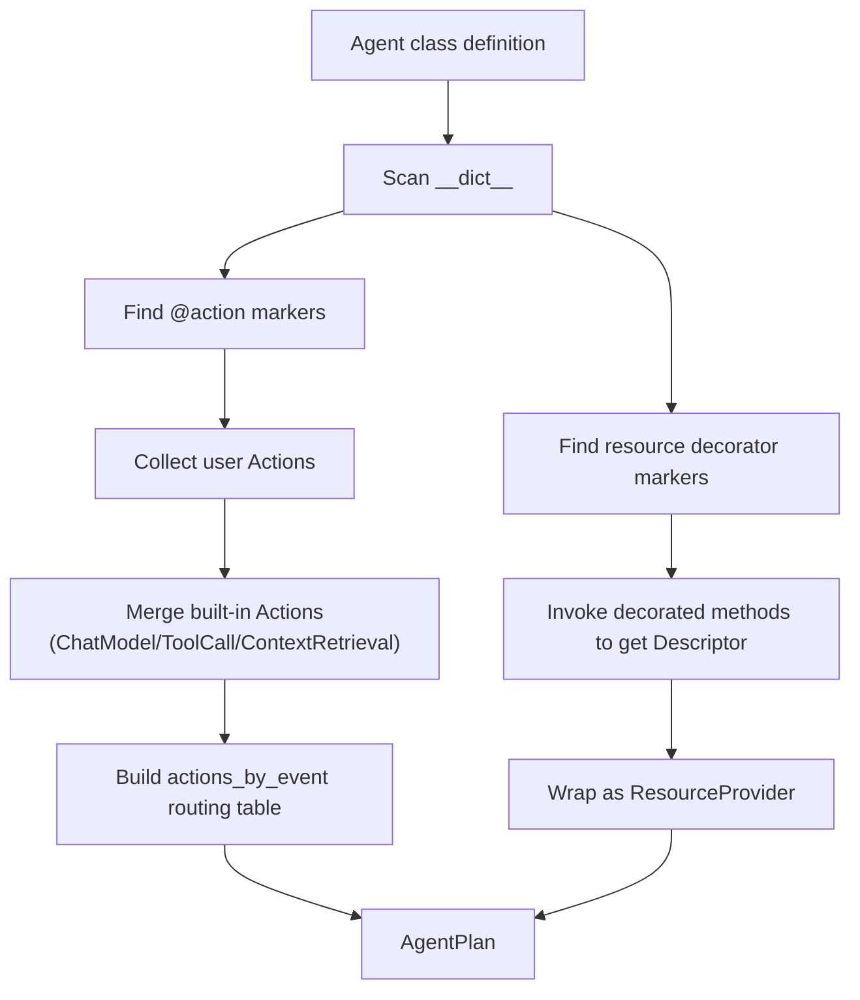

# Apache Flink Agents Framework: A Deep Dive into Principles

> This article is the first in the "Building an Intelligent Stock Trading System with Flink Agents" series. This installment focuses on framework principles, while the following three articles will explore hands-on demos of ReAct Agent, Workflow Agent, and YAML Agent respectively.

---

## 1. Introduction: Why Flink Agents

In an era where AI Agent frameworks like LangChain, CrewAI, and AutoGen are flourishing, the Apache community has introduced **Apache Flink Agents**. At first glance, it might seem like "reinventing the wheel," but a closer look reveals that it solves a unique problem — **how to make AI Agents run stably in production-grade distributed stream processing environments**.

Existing frameworks excel at "single-turn conversations" or "batch task orchestration," but struggle when faced with real-time streaming data scenarios. Take stock trading as an example: thousands of tick data points flood in every second, each requiring the Agent to analyze and make trading decisions instantly. The Agent must remember the holding status of each stock, and this memory must remain available across millions of invocations. When an LLM call fails or the system crashes, duplicate orders must not be placed — this requires Exactly-Once semantics. More critically, thousands of stocks need to be analyzed simultaneously, demanding horizontal scalability across multiple machines.

The core idea of Flink Agents is straightforward: **model the reasoning and decision-making process of AI Agents as Flink's event-driven data streams**. This way, Agents naturally inherit Flink's battle-tested capabilities in distributed scheduling, stateful management, fault recovery, and low-latency processing. It is not meant to replace LangChain, but rather to open up entirely new possibilities at the intersection of "stream processing + AI Agents."

To better understand the positioning of Flink Agents, it is necessary to conduct a systematic comparison with mainstream AI Agent frameworks.

### Comprehensive Comparison with Mainstream Frameworks

The table below compares Flink Agents with LangChain/LangGraph, CrewAI, AutoGen, and Semantic Kernel across three dimensions: architectural model, runtime capabilities, and developer experience.

| Dimension | Flink Agents | LangChain / LangGraph | CrewAI | AutoGen | Semantic Kernel |
|-----------|-------------|----------------------|--------|---------|----------------|
| **Positioning** | Agent framework for stream processing environments | General-purpose LLM application development framework | Multi-Agent role collaboration framework | Multi-Agent conversation framework | Enterprise AI orchestration SDK |
| **Core Abstraction** | Event + Action + RunnerContext | Chain / Graph / AgentExecutor | Crew + Agent + Task | Agent + GroupChat | Kernel + Plugin + Planner |
| **Programming Paradigm** | Event-driven (publish-subscribe) | Chain invocation / Directed graph | Declarative role orchestration | Conversational message passing | Functional pipeline orchestration |
| **Runtime Mode** | Local single-node + Flink distributed cluster | Single-process only | Single-process only | Single-process only | Single-process only |
| **Horizontal Scaling** | Native support (Flink parallelism) | Must self-build (queue + Workers) | Not supported | Not supported | Not supported |
| **State Management** | Flink Keyed State (automatic checkpoint) | In-memory / External storage (manual) | No built-in state | ConversationHistory (in-memory) | No built-in state |
| **Fault Recovery** | Exactly-Once (Durable Execution) | None | None | None | None |
| **Memory System** | Three-tier (Sensory/Short-term/Long-term) | Single-layer Memory abstraction | Short-term + Long-term (configurable) | ChatHistory | No built-in memory |
| **Multi-Agent** | Multi-Agent independent key-partitioned parallelism | LangGraph supports multi-node | Native multi-role collaboration | Native multi-Agent conversation | Manual orchestration required |
| **Tool System** | docstring auto-extraction + MCP | @tool decorator + MCP | @tool decorator | function_map registration | Plugin system |
| **Configuration** | Python decorators + YAML declarative | Python code | Python + YAML | Python code | Python / C# / Java |
| **LLM Integration** | Tongyi/OpenAI/Ollama/Anthropic | Broad (50+ Providers) | OpenAI / Ollama etc. | OpenAI primarily | OpenAI / Azure primarily |
| **Stream Data Processing** | Native (from_datastream) | Not supported | Not supported | Not supported | Not supported |

This table reveals a key dividing line: **single-machine frameworks and distributed frameworks solve fundamentally different problems**.

What LangChain and CrewAI excel at is "orchestration complexity" — how to combine multiple LLM calls, tool invocations, and retrieval steps in the correct order and logic. LangGraph goes a step further, using directed graphs to model complex workflows that include conditional branching and loops. These frameworks assume a single-process, single-user, request-response runtime environment — a user sends a request, the Agent processes it and returns a result.

Flink Agents, on the other hand, addresses "runtime complexity" — when an Agent needs to **continuously** process data streams, **maintain state consistency across millions of invocations**, **run in parallel across multiple machines**, and **recover precisely after failures**, the architectural foundation of single-machine frameworks falls short. You could wrap a Celery + Redis layer around LangChain to approximate distributed operation, but issues like state consistency, fault recovery, and Exactly-Once semantics must be solved at the architectural level — they cannot be patched with "just add a middleware."

The diagram below illustrates two typical runtime scenarios to help understand their positioning differences:



### Selection Recommendations

Which framework to choose depends on which quadrant your scenario falls into:

| | Single/Few Requests | Continuous Data Stream |
|---|---|---|
| **Single Agent** | LangChain (most mature ecosystem) | Flink Agents |
| **Multi-Agent Collaboration** | CrewAI / AutoGen | Flink Agents (key-partitioned parallelism) |

If your Agent follows the pattern "user asks a question, Agent thinks, returns an answer" — LangChain or CrewAI is the lighter choice. If your Agent needs to "process thousands of events per second, remember the historical state of each entity, run 7×24 uninterrupted, and recover in seconds after failure" — this is where Flink Agents shines.

---

## 2. Three-Layer Architecture Overview

Flink Agents divides the Agent lifecycle into three layers, each solving a specific class of problems.

```mermaid
graph TB
    subgraph 定义层["Definition Layer"]
        A1["Write Agent class in Python/Java"]
        A2["Decorators: @action / @tool / @prompt"]
        A3["Or YAML declarative configuration"]
    end

    subgraph 编译层["Compilation Layer"]
        B1["AgentPlan.from_agent()"]
        B2["Action metadata + Event routing table"]
        B3["ResourceProvider registry"]
    end

    subgraph 执行层["Execution Layer"]
        C1["Local mode: LocalRunner"]
        C2["Distributed mode: Flink ActionExecutionOperator"]
        C3["Unified RunnerContext interface"]
    end

    Definition Layer -->|"Compile"| Compilation Layer
    Compilation Layer -->|"Deploy"| Execution Layer
```

The **Definition Layer** is where developers interact directly. Here, you use Python classes and decorators to describe which events the Agent should listen to, which tools and models to use, or you can achieve the same declaration with a YAML file. All code in the Definition Layer is purely "descriptive" — it says "what I need," not "I am creating it right now."

The **Compilation Layer** is the bridge between definition and execution. The `AgentPlan.from_agent()` method scans all decorator markers on the Agent class, builds a routing table (`actions_by_event`) that maps event types to Action lists, and wraps each resource declaration into a serializable `ResourceProvider`. The compiled `AgentPlan` is a pure data object that can be safely sent over the network to any node in the Flink cluster.

The **Execution Layer** is responsible for actually processing events. In local mode, `LocalRunner` drives Action invocations with an event queue in a single thread, suitable for development and debugging. In distributed mode, `ActionExecutionOperator` runs as a Flink operator, with each parallel instance handling a subset of keys, and memory automatically participates in checkpointing via Flink Keyed State. Regardless of the mode, the Action code always faces the same `RunnerContext` interface, achieving "write once, run in both modes."

The fundamental motivation behind this three-layer separation is **serialization**. In a distributed environment, the Agent definition needs to be sent from the driver to each TaskManager node. If HTTP clients or database connections were instantiated at definition time, they could not be serialized and transmitted. The three-layer architecture ensures that the Definition Layer only produces serializable descriptors, deferring the actual resource instantiation to each node in the Execution Layer independently.

---

## 3. Event-Driven Model

### Event Structure

The core philosophy of Flink Agents is **Event-First** — all Agent behavior is expressed and driven through events. All events inherit from the `Event` base class, which has only three core fields: `id` (UUID), `type` (string), and `attributes` (dictionary).

The generation method for `id` is worth noting: it is a deterministic UUID (MD5 hash, version 3) based on the event content. This means that events with identical content will always produce the same id — a very useful feature in distributed fault-tolerance scenarios, where replaying the same message will not create a "new" event. The `type` string is the key for event routing; the framework uses it to determine which Actions should handle this event. The `attributes` dictionary carries all the business data of the event.

### Eight Built-in Event Types

The framework provides eight built-in event types, naturally grouped into four categories based on the Agent's interaction targets. `InputEvent` and `OutputEvent` mark the boundary between the Agent and the outside world — the former carries external data into the Agent, while the latter sends the Agent's processing results downstream. `ChatRequestEvent` and `ChatResponseEvent` encapsulate interactions with the large language model, representing "querying the LLM" and "LLM response" respectively. `ToolRequestEvent` and `ToolResponseEvent` correspond to tool invocation requests and responses. `ContextRetrievalRequestEvent` and `ContextRetrievalResponseEvent` are used for vector retrieval in RAG scenarios.

### Event Flow and Action Routing

The process of an Agent handling a single input is the journey of an event flowing through multiple Actions. Using the stock trading scenario as an example, the complete lifecycle of a tick data point is as follows:



There is a key insight in this flow chain: **the user only needs to write two Actions: `process_input` and `process_response`**. The intermediate steps — LLM invocation, tool execution, result feedback, retry handling — are all automatically handled by the framework's built-in `ChatModelAction` and `ToolCallAction`. The LLM may invoke multiple tools in succession; this loop repeats until the LLM provides the final text response, and the entire process is completely transparent to user code.

The mechanism for Action routing is simple: during the compilation phase, an `actions_by_event` mapping table is generated, mapping each event type to a list of Action names. When an event is sent via `ctx.send_event()`, the runtime looks up the table to find all matching Actions and invokes them sequentially. This is essentially a publish-subscribe pattern, where events are messages and Actions are subscribers.

---

## 4. Two Paradigms of Agents

Flink Agents provides two ways to build Agents, representing the two ends of the "convenience vs. flexibility" spectrum.

**ReAct Agent** is the framework's pre-built Agent type, implementing the Reasoning + Acting loop. To use it, you only need to provide the model configuration, tool list, and prompt template — no need to write any Actions or understand event flow. Internally, it automatically registers two Actions: `start_action` listens for `InputEvent`, formats user input into a prompt, and sends a `ChatRequestEvent`; `stop_action` listens for `ChatResponseEvent`, extracts the LLM's final response, and sends an `OutputEvent`. The intermediate multi-round tool-calling loop is driven by the framework's built-in Actions. The ReAct Agent is well-suited for "single-turn analysis and Q&A" scenarios — give it a piece of tick data, it autonomously decides which tools to call, and finally outputs a structured trading decision.

**Workflow Agent** is a fully customizable Agent type. Developers extend the `Agent` base class, use the `@action` decorator to declare which event type each method listens to, and have complete control over event chain orchestration. The core advantage of this approach is **multi-stage processing** — you can define multiple `@chat_model_setup` configurations with different LLM models (e.g., one for technical analysis, one for trading decisions), and in `process_response`, decide based on the current stage whether to continue with another round of LLM calls or output the final result. This gives developers the ability to construct arbitrarily complex event flows.



The choice between the two depends on scenario complexity. If your Agent only needs "one model + a few tools + one round of reasoning," a ReAct Agent can be set up in just tens of lines of code. If you need multi-stage orchestration, cross-stage memory passing, or multi-model collaboration, the Workflow Agent's full control is necessary. The second and third articles in this series will demonstrate both patterns with hands-on code.

---

## 5. Resource System: Descriptors and Lazy Instantiation

### The Core Problem

Suppose your Agent needs to call the Tongyi Qianwen API. In LangChain, you would directly write `client = DashScopeClient(api_key=...)` and use this client in your Agent code. However, in Flink Agents' distributed scenario, this Agent definition must be serialized and transmitted from the driver node to multiple TaskManager nodes — and an HTTP client object is clearly not serializable.

### Descriptor Pattern

Flink Agents solves this problem using **ResourceDescriptor**. It only stores the resource's "identity document" — the fully qualified class path and constructor parameters — without instantiating anything. When an Agent definition declares "I need a Tongyi Qianwen connection," it actually just creates a data object containing `clazz="flink_agents.integrations.chat_models.tongyi_chat_model.TongyiChatModelConnection"`. This data object is a pure Pydantic Model that can be safely JSON-serialized and deserialized.

The actual instantiation happens at the Execution Layer. The `ResourceCache` on each TaskManager node, upon first request for a resource, dynamically loads the class via `importlib.import_module()` and calls the constructor based on the descriptor. Subsequent requests within the same node share the same resource instance, avoiding duplicate creation.



### Resource Types and Registration Paths

The framework defines nine resource types, covering all aspects of Agent operation. `CHAT_MODEL_CONNECTION` represents the connection configuration to an LLM service (such as API endpoint and key), while `CHAT_MODEL` adds the specific model name, temperature parameters, associated tools, and prompt on top of the connection. `TOOL` encapsulates callable tool functions, and `PROMPT` stores prompt templates. `EMBEDDING_MODEL_CONNECTION`, `EMBEDDING_MODEL`, and `VECTOR_STORE` work together for vector retrieval in RAG scenarios. `MCP_SERVER` interfaces with external tools provided by Model Context Protocol servers. `SKILLS` manages skill package loading and discovery.

Resources can be registered through two paths. One is using decorators (such as `@tool`, `@prompt`) inside the Agent class — these resources belong to that Agent instance. The other is calling `env.add_resource()` on the execution environment — these resources are globally shared and can be referenced by multiple Agents. Both paths ultimately converge into the same `ResourceCache`, managed uniformly at runtime.

---

## 6. Three-Tier Memory System

Flink Agents draws inspiration from cognitive science's memory classification model, implementing a three-tier memory system. The elegance of this design lies in how it maps data requirements with different lifecycles to different storage mechanisms.



**Sensory Memory** (sensory_memory) has a lifetime of a single Agent run — the complete chain from receiving an `InputEvent` to emitting an `OutputEvent`. After the run ends, the framework automatically clears all sensory memory content. Its typical use is passing intermediate results between multiple Actions within the same run. In a stock trading Agent, `process_input` stores the current tick data in sensory memory, and subsequent `process_response` can read this data. More cleverly, sensory memory can also serve as a "stage marker" — by checking whether a certain key already exists, you can determine which stage of the processing chain you are currently in.

**Short-Term Memory** (short_term_memory) has a lifetime that spans multiple Agent runs, but is confined to the same key (in Flink, this is the KeyedStream key). In distributed mode, it is implemented based on Flink's Keyed MapState, automatically participating in checkpointing and fault recovery. In the stock scenario, each stock uses the symbol as its key, and short-term memory tracks the holding quantity and average cost for that stock. When multiple ticks for the same stock arrive sequentially, the Agent can read the previous position state from short-term memory to inform its decision.

**Long-Term Memory** (long_term_memory) is based on a vector database (integrated through the Mem0 framework), supporting semantic retrieval. Its lifetime is permanent, suitable for storing general knowledge that spans across all keys, such as historical patterns like "Apple usually rises before earnings season." The Agent can query relevant memories through natural language, providing contextual background for current decisions.

---

## 7. Tool System and Metadata Extraction

Tools are the bridge between the Agent and the external world. In Flink Agents, a Python function only needs to meet two conditions to become a callable tool for the Agent: be marked with the `@tool` decorator (or registered via `Tool.from_callable()`), and have a docstring written in numpydoc format.

The framework's metadata extraction process is automated. During the compilation phase, the `docstring_parser` library parses the function's docstring, extracting the tool description (the first line of the docstring) and the explanation for each parameter (the content of the Parameters section). At the same time, Python's type annotations provide parameter type information and default values. Combining the two, the framework automatically generates a Pydantic BaseModel as the parameter Schema. This Schema is ultimately converted into the LLM's function calling format — for Tongyi Qianwen, this is the DashScope API's `tools` parameter — informing the LLM which tools are available and how to correctly pass parameters.



The framework supports four tool types. `FUNCTION` is the most common — user-defined Python or Java functions. `MCP` tools come from MCP (Model Context Protocol) servers, allowing the Agent to seamlessly integrate with external tool ecosystems. `MODEL_BUILT_IN` refers to tools built into the model itself (such as OpenAI's web_search). `REMOTE_FUNCTION` corresponds to functions invoked over the network.

Tool invocation forms an automatic loop at runtime: during reasoning, the LLM decides to call a tool, and the framework generates a `ToolRequestEvent`; the built-in `ToolCallAction` captures this event, executes the corresponding tool function, and wraps the result as a `ToolResponseEvent`; the built-in `ChatModelAction` then incorporates the tool result into the message history and resubmits it to the LLM. This loop may repeat multiple times (as the LLM calls several tools in succession) until the LLM stops requesting tool calls and provides the final text response. The entire process is completely transparent to user code.

---

## 8. Compilation and Execution

### Compilation Process

`AgentPlan.from_agent()` is the core method that transforms an Agent definition into an executable plan. Its work is divided into two phases.

The first phase is **Action scanning**. The method iterates through the Agent class's `__dict__`, looking for all methods marked with the `@action` decorator (identified by the `_listen_events` attribute), and collects them along with three framework-built-in Actions (`ChatModelAction`, `ToolCallAction`, `ContextRetrievalAction`). Each Action is wrapped into a data object containing the name, the executable function reference, and the list of event types it listens to. The event listening information from all Actions is aggregated into the `actions_by_event` mapping table — this is the core data structure for event routing.

The second phase is **resource provider extraction**. The method scans the class dictionary again, this time looking for markers from decorators like `@chat_model_connection`, `@chat_model_setup`, `@tool`, `@prompt`, `@skills`. Each marked method is invoked once to obtain its returned `ResourceDescriptor`, which is then wrapped into a corresponding `ResourceProvider` (a serializable resource provider). For MCP servers, the compilation phase eagerly instantiates them once to discover which tools and prompts they provide, registers those into the resource table, and then closes the connection.



### Local Execution

The event loop of `LocalRunner` is a simple while loop. It maintains a per-key event queue (Python deque). When processing an input, it first wraps it as an `InputEvent` and enqueues it, then continuously dequeues events from the front: if it is an `OutputEvent`, it collects it into the output list; otherwise, it looks up `actions_by_event` to find the matching Action and invokes it. New events generated by Actions via `ctx.send_event()` are appended to the tail of the same queue, forming an event cascade. This pattern of "current event triggers a new event, which in turn triggers more Actions" naturally unfolds the LLM call → tool execution → result feedback loop without any explicit loop control.

### Distributed Execution and Fault Tolerance

When running on a Flink cluster, `ActionExecutionOperator` replaces the role of `LocalRunner`. Each parallel instance handles a subset of keys (partitioning determined by `key_selector`), and short-term memory automatically participates in checkpointing via Flink Keyed MapState.

Flink Agents' fault-tolerance mechanism (Durable Execution) is a core advantage that distinguishes it from other frameworks. During normal operation, the result of each LLM call is persisted to a StateStore (such as Kafka or Fluss). When the system recovers from a failure, the framework first checks the StateStore for a cached result — if found, it skips the actual LLM call and uses the cached result directly. This means that even if the system crashes in the middle of "calling LLM → receiving result → preparing to place an order," the LLM will not be called again after recovery, preventing duplicate orders and truly achieving end-to-end Exactly-Once semantics.

---

## 9. YAML Declarations and Skills

### YAML Declarative Configuration

Not everyone who needs to configure an Agent is a Python developer. Data analysts may simply want to adjust the model or tool list the Agent uses, while operations staff may need to switch the connection address of the LLM service. YAML declarative configuration is designed precisely for these needs.

A YAML file can define all of an Agent's resources — connection configurations, model settings, tool lists, prompt templates — while the Action processing logic still references functions in Python code. This division of labor ("YAML manages resources, Python manages logic") allows configuration changes without touching business code. The framework provides an alias system to simplify YAML authoring: `clazz: tongyi` is automatically resolved to the full path of the Tongyi Qianwen connection class, and `listen_to: [input]` is resolved to `["_input_event"]`. Function references use the `module:qualname` format, e.g., `tools:calculate_rsi` means importing the `calculate_rsi` function from the `tools` module.

### Skills Progressive Loading

The Skills system implements a **progressive capability discovery** mechanism, inspired by the "load on demand" design philosophy.

```mermaid
graph LR
    subgraph 发现阶段["Discovery Phase (~100 tokens)"]
        S1["Load SKILL.md's<br>YAML frontmatter"]
        S2["name + description<br>injected into system prompt"]
    end

    subgraph 激活阶段["Activation Phase (on demand)"]
        S3["LLM calls load_skill tool"]
        S4["Load full SKILL.md<br>markdown content"]
    end

    subgraph 执行阶段["Execution Phase (on demand)"]
        S5["Resources and scripts<br>referenced in skill loaded on demand"]
    end

    Discovery Phase --> Activation Phase
    Activation Phase --> Execution Phase
```

When the Agent starts, the Skills system only loads the name and description of each skill (from the YAML frontmatter of the SKILL.md file) — no more than a hundred tokens in total — and injects them into the system prompt. When the LLM determines during reasoning that a certain skill is relevant to the current task, it actively calls the framework's built-in `load_skill` tool, which then loads the full markdown content of that skill (potentially containing detailed operation guides, scoring rules, etc.). External resources referenced in the skill are deferred until actually needed. This three-phase progressive loading effectively controls context length — the Agent does not need to carry the full instructions of all skills in every reasoning step.

---

## 10. Summary and Series Preview

The design of Flink Agents revolves around several core principles. **Event-First** models all Agent behavior as event streams, making complex multi-step reasoning processes observable, replayable, and fault-tolerant. **Lazy Instantiation** solves the distributed serialization problem through the descriptor pattern, allowing the same Agent code to seamlessly switch between local debugging and cluster deployment. **Three-Tier Memory** maps data requirements at different time scales to appropriate storage mechanisms. **Progressive Loading** controls cognitive and computational burden while maintaining extensibility.

How do these principles translate into runnable code? The next three articles will demonstrate them one by one. [Article 2](article-2-react-agent.md) builds a ReAct Agent in 60 lines of code, showcasing the simplest "model + tools + structured output" pattern. [Article 3](article-3-workflow-agent.md) builds a multi-stage Workflow Agent, comprehensively employing decorators, dual models, the memory system, and Skills. [Article 4](article-4-yaml-agent.md) converts the same Agent logic to YAML declarative configuration, demonstrating a "zero Python resource definition" development experience.