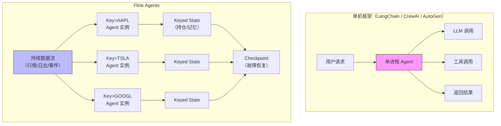
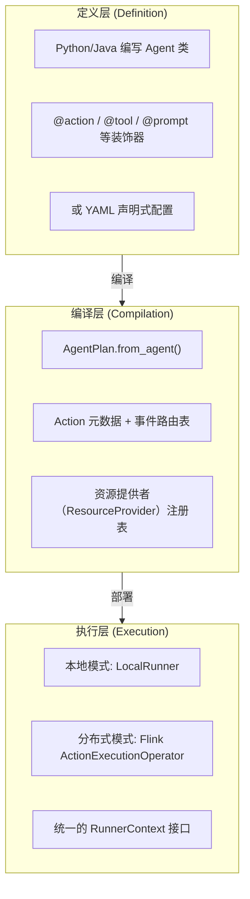
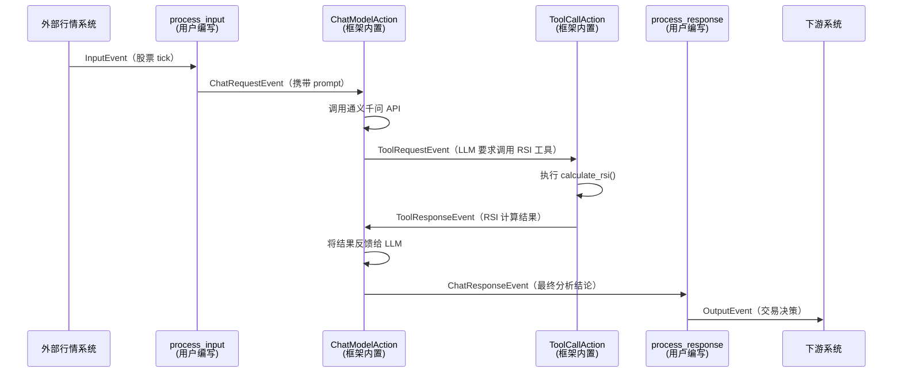
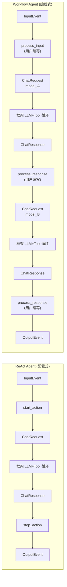
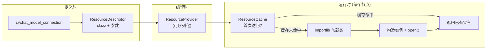
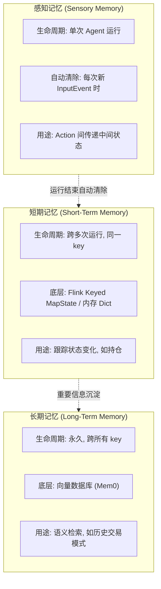
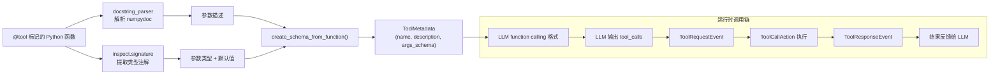
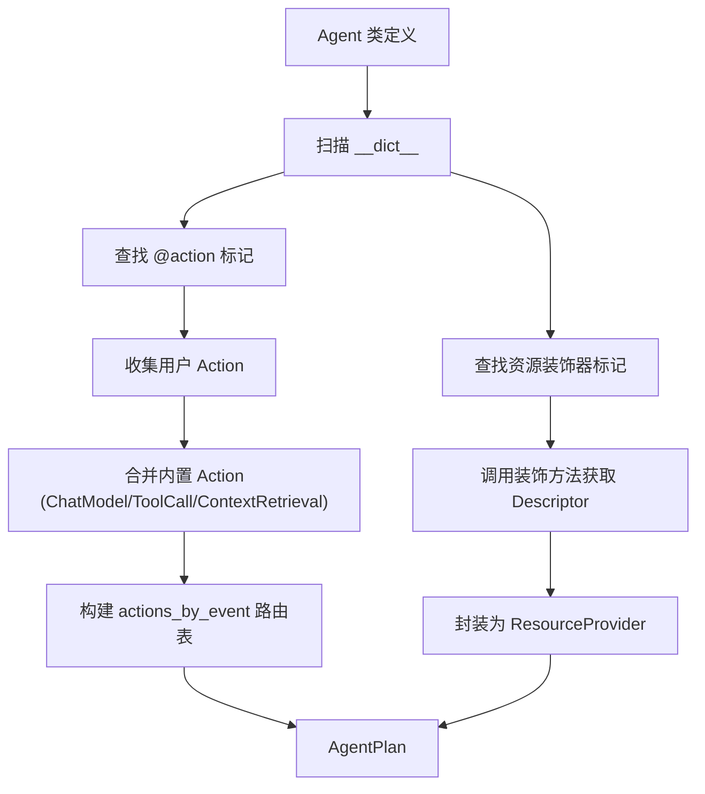
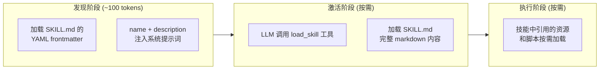

# Apache Flink Agents 框架原理深度解析

> 本文是"基于 Flink Agents 构建智能股票交易系统"系列的第一篇。本篇聚焦框架原理，后续三篇将分别以 ReAct Agent、Workflow Agent 和 YAML Agent 三个实战 Demo 展开。

---

## 一、引言：为什么需要 Flink Agents

在 LangChain、CrewAI、AutoGen 等 AI Agent 框架百花齐放的今天，Apache 社区推出了 **Apache Flink Agents**。初看似乎是"重复造轮子"，但仔细审视就会发现，它解决的是一个独特的问题——**如何让 AI Agent 在生产级的分布式流处理环境中稳定运行**。

现有框架擅长"单次对话"或"批量任务编排"，但面对实时流数据场景时力不从心。以股票交易为例，行情 tick 每秒涌入数千条，每一条都需要 Agent 即时分析并做出交易决策；Agent 必须记住每只股票的持仓状态，这份记忆要跨越数百万次调用始终可用；当 LLM 调用失败或系统崩溃时，不能重复下单——需要 Exactly-Once 语义保证；更关键的是，成千上万只股票需要同时被分析，这要求 Agent 能水平扩展到多台机器。

Flink Agents 的核心思路非常直接：**将 AI Agent 的推理与决策过程建模为 Flink 的事件驱动数据流**。这样 Agent 天然获得了 Flink 久经生产验证的分布式调度、有状态管理、故障恢复和低延迟处理能力。它不是要替代 LangChain，而是在"流处理 + AI Agent"这个交叉地带开辟了全新的可能。

为了更清楚地理解 Flink Agents 的定位，有必要将它与主流 AI Agent 框架做一次系统对比。

### 与主流框架的全景对比

下表从架构模型、运行时能力、开发体验三个维度，将 Flink Agents 与 LangChain/LangGraph、CrewAI、AutoGen、Semantic Kernel 进行对比。

| 维度 | Flink Agents | LangChain / LangGraph | CrewAI | AutoGen | Semantic Kernel |
|------|-------------|----------------------|--------|---------|----------------|
| **定位** | 流处理环境下的 Agent 框架 | 通用 LLM 应用开发框架 | 多 Agent 角色协作框架 | 多 Agent 对话框架 | 企业级 AI 编排 SDK |
| **核心抽象** | Event + Action + RunnerContext | Chain / Graph / AgentExecutor | Crew + Agent + Task | Agent + GroupChat | Kernel + Plugin + Planner |
| **编程范式** | 事件驱动（发布-订阅） | 链式调用 / 有向图 | 声明式角色编排 | 对话式消息传递 | 函数式管道编排 |
| **运行模式** | 本地单机 + Flink 分布式集群 | 仅单机进程 | 仅单机进程 | 仅单机进程 | 仅单机进程 |
| **水平扩展** | 原生支持（Flink 并行度） | 需自建（队列 + Worker） | 不支持 | 不支持 | 不支持 |
| **状态管理** | Flink Keyed State（自动 checkpoint） | 内存 / 外部存储（手动） | 无内置状态 | ConversationHistory（内存） | 无内置状态 |
| **容错恢复** | Exactly-Once（Durable Execution） | 无 | 无 | 无 | 无 |
| **记忆体系** | 三级（感知/短期/长期） | 单层 Memory 抽象 | 短期 + 长期（需配置） | ChatHistory | 无内置记忆 |
| **多 Agent** | 多 Agent 独立 key 分区并行 | LangGraph 支持多节点 | 原生多角色协作 | 原生多 Agent 对话 | 需手动编排 |
| **工具系统** | docstring 自动提取 + MCP | @tool 装饰器 + MCP | @tool 装饰器 | function_map 注册 | Plugin 插件体系 |
| **配置方式** | Python 装饰器 + YAML 声明式 | Python 代码 | Python + YAML | Python 代码 | Python / C# / Java |
| **LLM 集成** | 通义/OpenAI/Ollama/Anthropic | 广泛（50+ Provider） | OpenAI / Ollama 等 | OpenAI 为主 | OpenAI / Azure 为主 |
| **流数据处理** | 原生（from_datastream） | 不支持 | 不支持 | 不支持 | 不支持 |

这张表格揭示了一个关键分水岭：**单机框架和分布式框架解决的是根本不同的问题**。

LangChain 和 CrewAI 擅长的是"编排复杂度"——如何让多个 LLM 调用、工具调用、检索步骤按照正确的顺序和逻辑组合在一起。LangGraph 更进一步，用有向图建模了包含条件分支和循环的复杂工作流。这些框架假设的运行环境是单进程、单用户、请求-响应模式——一个用户发来一个请求，Agent 处理完返回结果。

Flink Agents 解决的则是"运行时复杂度"——当 Agent 需要**持续不断**地处理数据流、**跨越数百万次调用**保持状态一致、在**多台机器**上并行运行、并在**故障后精确恢复**时，单机框架的架构根基就不够了。你可以在 LangChain 外面套一层 Celery + Redis 来近似实现分布式，但状态一致性、故障恢复、Exactly-Once 语义这些问题需要从架构层面解决，不是"加个中间件"能补齐的。

下面这张图展示了两种典型的运行场景，帮助理解它们的定位差异：

### 选择建议

选择哪个框架，取决于你的场景落在哪个象限：

| | 单次/少量请求 | 持续数据流 |
|---|---|---|
| **单 Agent** | LangChain（最成熟生态）| Flink Agents |
| **多 Agent 协作** | CrewAI / AutoGen | Flink Agents（按 key 分区并行） |

如果你的 Agent 是"用户问一个问题，Agent 想一想，回答一个答案"——LangChain 或 CrewAI 是更轻量的选择。如果你的 Agent 需要"每秒处理上千条事件，记住每个实体的历史状态，7×24 小时不间断运行，故障后秒级恢复"——这正是 Flink Agents 的主场。

---

## 二、三层架构总览

Flink Agents 将 Agent 的生命周期划分为三个层次，每一层解决一类特定的问题。

**定义层**是开发者直接打交道的地方。在这里，你用 Python 类和装饰器描述 Agent 需要监听哪些事件、使用哪些工具和模型，或者用一个 YAML 文件完成同样的声明。定义层的所有代码都是纯粹的"描述"——它说的是"我需要什么"，而非"我现在就要创建什么"。

**编译层**是定义与执行之间的桥梁。`AgentPlan.from_agent()` 方法扫描 Agent 类上的所有装饰器标记，构建出事件类型到 Action 列表的路由映射表（`actions_by_event`），同时将每个资源声明封装为可序列化的 `ResourceProvider`。编译后的 `AgentPlan` 是一个纯数据对象，可以安全地通过网络发送到 Flink 集群的任意节点。

**执行层**负责真正处理事件。本地模式下，`LocalRunner` 在单线程中用一个事件队列驱动 Action 调用，适合开发调试。分布式模式下，`ActionExecutionOperator` 作为 Flink 算子运行，每个并行实例处理一部分 key，记忆基于 Flink Keyed State 自动参与 checkpoint。无论哪种模式，Action 代码面对的都是同一个 `RunnerContext` 接口，实现了"一次编写，两种模式运行"。

这种三层分离的根本动机在于**序列化**。分布式环境下，Agent 定义需要从 driver 端发送到各个 TaskManager 节点。如果在定义时就实例化了 HTTP 客户端或数据库连接，它们无法被序列化传输。三层架构确保了定义层只产生可序列化的描述符，真正的资源实例化推迟到执行层的每个节点上独立完成。

---

## 三、事件驱动模型

### 事件的结构

Flink Agents 的核心哲学是 **Event-First**——Agent 的一切行为都通过事件来表达和驱动。所有事件继承自 `Event` 基类，它只有三个核心字段：`id`（UUID）、`type`（字符串）和 `attributes`（字典）。

`id` 的生成方式值得一提：它是基于事件内容的确定性 UUID（MD5 哈希，version 3）。这意味着相同内容的事件一定产生相同的 id，这个特性在分布式容错场景下非常有用——重放同一条消息不会产生"新"事件。`type` 字符串是事件路由的关键，框架根据它来决定哪些 Action 应该处理这个事件。`attributes` 字典则承载了事件的全部业务数据。

### 八种内置事件类型

框架内置了八种事件类型，它们按照 Agent 的交互对象自然地分为四组。`InputEvent` 和 `OutputEvent` 标记了 Agent 与外部世界的边界，前者携带外部数据进入 Agent，后者将 Agent 的处理结果送往下游。`ChatRequestEvent` 和 `ChatResponseEvent` 封装了与大语言模型的交互，分别代表"向 LLM 提问"和"LLM 回答"。`ToolRequestEvent` 和 `ToolResponseEvent` 对应工具调用的请求与响应。`ContextRetrievalRequestEvent` 和 `ContextRetrievalResponseEvent` 用于 RAG 场景的向量检索。

### 事件流转与 Action 路由

Agent 处理一次输入的过程，就是一条事件在多个 Action 之间流转的过程。以股票交易场景为例，一条行情 tick 的完整生命周期如下：

这条流转链中有一个关键洞察：**用户只需编写 `process_input` 和 `process_response` 两个 Action**。中间的 LLM 调用、工具执行、结果回馈、重试处理，全部由框架内置的 `ChatModelAction` 和 `ToolCallAction` 自动完成。LLM 可能连续调用多个工具，这个循环会反复执行直到 LLM 给出最终文本回答，整个过程对用户代码完全透明。

Action 路由的机制很简单：编译阶段生成一张 `actions_by_event` 映射表，将每种事件类型映射到一个 Action 名称列表。当一个事件被 `ctx.send_event()` 发送时，运行时查表找到所有匹配的 Action 并依次调用。这本质上是一种发布-订阅模式，事件是消息，Action 是订阅者。

---

## 四、Agent 的两种范式

Flink Agents 提供了两种 Agent 构建方式，它们代表了"便捷性"与"灵活性"的两端。

**ReAct Agent** 是框架预构建的 Agent 类型，实现了 Reasoning + Acting 循环。使用时只需传入模型配置、工具列表和 prompt 模板即可——不用写任何 Action，也不用理解事件流转。它的内部自动注册了两个 Action：`start_action` 监听 `InputEvent`，负责将用户输入格式化为 prompt 并发送 `ChatRequestEvent`；`stop_action` 监听 `ChatResponseEvent`，负责提取 LLM 最终响应并发送 `OutputEvent`。中间的多轮工具调用循环由框架内置 Action 驱动。ReAct Agent 非常适合"单轮分析问答"场景——给它一条行情数据，它自主决定调用哪些工具，最后输出一个结构化的交易决策。

**Workflow Agent** 则是完全自定义的 Agent 类型。开发者继承 `Agent` 基类，用 `@action` 装饰器声明每个方法监听哪种事件类型，完全掌控事件链的编排。这种方式的核心优势在于**多阶段处理**——你可以定义多个 `@chat_model_setup` 配置不同的 LLM 模型（比如一个负责技术分析、一个负责交易决策），在 `process_response` 中根据当前阶段决定是继续发起下一轮 LLM 调用还是输出最终结果。这给了开发者构建任意复杂事件流的能力。

两者的选择取决于场景复杂度。如果你的 Agent 只需"一个模型 + 若干工具 + 一次推理"，ReAct Agent 几十行代码就能搞定。如果你需要多阶段编排、跨阶段记忆传递、多模型协作，就需要 Workflow Agent 的完全控制力。本系列的第二篇和第三篇文章将分别用实战代码展示这两种模式。

---

## 五、资源系统：描述符与延迟实例化

### 核心问题

假设你的 Agent 需要调用通义千问 API。在 LangChain 中，你会直接写 `client = DashScopeClient(api_key=...)`，然后在 Agent 代码中使用这个 client。但在 Flink Agents 的分布式场景下，这个 Agent 定义需要从 driver 节点序列化传输到多个 TaskManager 节点——而 HTTP 客户端对象显然无法被序列化。

### 描述符模式

Flink Agents 用 **ResourceDescriptor** 解决了这个问题。它只存储资源的"身份证"——类的完全限定路径和构造参数——而不实例化任何东西。当 Agent 定义声明"我需要一个通义千问连接"时，它实际上只是创建了一个包含 `clazz="flink_agents.integrations.chat_models.tongyi_chat_model.TongyiChatModelConnection"` 的数据对象。这个数据对象是纯粹的 Pydantic Model，可以安全地 JSON 序列化、反序列化。

真正的实例化发生在执行层。每个 TaskManager 节点上的 `ResourceCache` 在首次需要某个资源时，才根据描述符通过 `importlib.import_module()` 动态加载类并调用构造函数。同一个节点内的多次请求共享同一个资源实例，避免了重复创建。

### 资源类型与注册路径

框架定义了九种资源类型，覆盖了 Agent 运行所需的方方面面。`CHAT_MODEL_CONNECTION` 表示与 LLM 服务的连接配置（如 API endpoint 和密钥），`CHAT_MODEL` 则是在连接之上叠加了具体的模型名称、温度参数、关联的工具和 prompt。`TOOL` 封装可调用的工具函数，`PROMPT` 存储提示词模板。`EMBEDDING_MODEL_CONNECTION`、`EMBEDDING_MODEL` 和 `VECTOR_STORE` 三者配合用于 RAG 场景的向量检索。`MCP_SERVER` 对接 Model Context Protocol 服务器提供的外部工具。`SKILLS` 管理技能包的加载与发现。

资源可以通过两种路径注册。一种是在 Agent 类内部使用装饰器（如 `@tool`、`@prompt`），这些资源归属于该 Agent 实例。另一种是在执行环境上调用 `env.add_resource()`，这些资源是全局共享的，可以被多个 Agent 引用。两种方式最终都汇入同一个 `ResourceCache`，在运行时统一管理。

---

## 六、三级记忆体系

Flink Agents 借鉴认知科学的记忆分类模型，实现了三级记忆体系。这个设计的精妙之处在于，它将不同生命周期的数据需求映射到了不同的存储机制上。

**感知记忆**（sensory_memory）的生命周期是一次 Agent 运行——从收到一个 `InputEvent` 到发出 `OutputEvent` 的完整链路。运行结束后框架自动清除所有感知记忆内容。它的典型用途是在同一次运行内的多个 Action 之间传递中间结果。在股票交易 Agent 中，`process_input` 将当前 tick 数据存入感知记忆，后续的 `process_response` 就能读取到这份数据。更巧妙的是，感知记忆还可以充当"阶段标记"——通过检查某个 key 是否已存在来判断当前处于处理链的哪个阶段。

**短期记忆**（short_term_memory）的生命周期跨越多次 Agent 运行，但限定在同一个 key（在 Flink 中就是 KeyedStream 的 key）。在分布式模式下，它基于 Flink 的 Keyed MapState 实现，自动参与 checkpoint 和故障恢复。在股票场景中，每只股票用 symbol 作为 key，短期记忆用来跟踪该股票的持仓数量和均价。当同一只股票的多个 tick 依次到来时，Agent 可以从短期记忆中读取上一次的持仓状态来辅助决策。

**长期记忆**（long_term_memory）基于向量数据库（通过 Mem0 框架集成），支持语义检索。它的生命周期是永久的，适合存储跨越所有 key 的通用知识，比如"苹果公司在财报季前通常上涨"这样的历史模式。Agent 可以通过自然语言查询来检索相关记忆，为当前决策提供背景知识。

---

## 七、工具系统与元数据提取

工具是 Agent 与外部世界交互的桥梁。在 Flink Agents 中，一个 Python 函数只需满足两个条件就能成为 Agent 可调用的工具：加上 `@tool` 装饰器（或通过 `Tool.from_callable()` 注册），并编写符合 numpydoc 格式的 docstring。

框架内部的元数据提取流程是自动化的。编译阶段，`docstring_parser` 库解析函数的 docstring，提取出工具的描述（docstring 第一行）和每个参数的说明（Parameters 段落的内容）。与此同时，Python 的类型注解提供了参数类型信息和默认值。两者结合，框架自动生成一个 Pydantic BaseModel 作为参数 Schema。这个 Schema 最终被转换为 LLM 的 function calling 格式——对于通义千问就是 DashScope API 的 `tools` 参数——让 LLM 知道有哪些工具可用以及如何正确传参。

框架支持四种工具类型。`FUNCTION` 是最常见的，就是用户自定义的 Python 或 Java 函数。`MCP` 类型的工具来自 MCP（Model Context Protocol）服务器，这使得 Agent 可以无缝接入外部工具生态。`MODEL_BUILT_IN` 是模型本身内置的工具（如 OpenAI 的 web_search）。`REMOTE_FUNCTION` 对应通过网络调用的远程函数。

工具调用在运行时形成一个自动循环：LLM 在推理过程中决定调用某个工具，框架生成 `ToolRequestEvent`；内置的 `ToolCallAction` 捕获此事件，执行对应的工具函数，将结果封装为 `ToolResponseEvent`；内置的 `ChatModelAction` 再将工具结果拼入消息历史，重新提交给 LLM。这个循环可能重复多次（LLM 连续调用多个工具），直到 LLM 不再请求工具调用、给出最终文本回答为止。整个过程对用户代码完全透明。

---

## 八、编译与执行

### 编译过程

`AgentPlan.from_agent()` 是将 Agent 定义转换为可执行计划的核心方法。它的工作分为两个阶段。

第一阶段是 **Action 扫描**。方法遍历 Agent 类的 `__dict__`，寻找所有被 `@action` 装饰器标记的方法（通过检查 `_listen_events` 属性），将它们连同三个框架内置 Action（`ChatModelAction`、`ToolCallAction`、`ContextRetrievalAction`）一起收集。每个 Action 被封装为一个数据对象，包含名称、可执行函数引用和监听的事件类型列表。所有 Action 的事件监听信息被汇总为 `actions_by_event` 映射表——这就是事件路由的核心数据结构。

第二阶段是**资源提供者提取**。方法再次扫描类字典，这次寻找 `@chat_model_connection`、`@chat_model_setup`、`@tool`、`@prompt`、`@skills` 等装饰器的标记。每个被标记的方法被调用一次以获取其返回的 `ResourceDescriptor`，然后封装为对应的 `ResourceProvider`（可序列化的资源提供者）。对于 MCP 服务器，编译时还会急切地实例化一次来发现它提供了哪些工具和 prompt，注册到资源表后再关闭连接。

### 本地执行

`LocalRunner` 的事件循环是一个朴素的 while 循环。它维护一个每个 key 独立的事件队列（Python deque）。处理一条输入时，先将其包装为 `InputEvent` 入队，然后不断从队列头部取出事件：如果是 `OutputEvent`，收集到输出列表；否则查 `actions_by_event` 找到匹配的 Action 并调用。Action 内部通过 `ctx.send_event()` 产生的新事件会被追加到同一个队列尾部，形成事件级联。这种"当前事件触发新事件、新事件又触发更多 Action"的模式，使得 LLM 调用→工具执行→结果反馈的循环自然地展开，无需任何显式的循环控制。

### 分布式执行与容错

在 Flink 集群上运行时，`ActionExecutionOperator` 取代了 `LocalRunner` 的角色。每个并行实例处理一部分 key（由 `key_selector` 决定分区），短期记忆基于 Flink Keyed MapState 自动参与 checkpoint。

Flink Agents 的容错机制（Durable Execution）是区别于其他框架的核心优势。正常运行时，每次 LLM 调用的结果会被持久化到 StateStore（如 Kafka 或 Fluss）。当系统故障恢复时，框架先检查 StateStore 中是否有缓存结果——如果有，就跳过实际的 LLM 调用直接使用缓存。这意味着即使在"调用 LLM → 收到结果 → 准备下单"的过程中系统崩溃，恢复后也不会重复调用 LLM 导致重复下单，真正实现了端到端的 Exactly-Once 语义。

---

## 九、YAML 声明与 Skills

### YAML 声明式配置

并非所有需要配置 Agent 的人都是 Python 开发者。数据分析师可能只想调整 Agent 使用的模型或工具列表，运维人员可能需要切换 LLM 服务的连接地址。YAML 声明式配置正是为这类需求设计的。

YAML 文件可以定义 Agent 的全部资源——连接配置、模型设置、工具列表、提示词模板——而 Action 的处理逻辑仍然引用 Python 代码中的函数。这种"YAML 管资源、Python 管逻辑"的分工，让配置变更无需触碰业务代码。框架提供了一套别名系统来简化 YAML 编写：`clazz: tongyi` 会被自动解析为通义千问连接类的完整路径，`listen_to: [input]` 会被解析为 `["_input_event"]`。函数引用使用 `module:qualname` 格式，如 `tools:calculate_rsi` 表示从 `tools` 模块导入 `calculate_rsi` 函数。

### Skills 渐进式加载

Skills（技能）系统实现了一种**渐进式能力发现**机制，灵感来自"按需加载"的设计理念。

Agent 启动时，Skills 系统只加载每个技能的名称和描述（来自 SKILL.md 文件的 YAML frontmatter），总共不过百来个 token，将其注入到系统提示词中。当 LLM 在推理过程中判断某个技能与当前任务相关时，它会主动调用框架注册的 `load_skill` 内置工具，这才加载该技能的完整 markdown 内容（可能包含详细的操作指南、评分规则等）。技能中引用的外部资源则推迟到实际使用时才加载。这种三阶段渐进加载有效控制了上下文长度——Agent 不必在每次推理时都携带所有技能的完整说明。

---

## 十、总结与系列预告

Flink Agents 的设计围绕几个核心理念展开。**Event-First** 将 Agent 的一切行为建模为事件流，让复杂的多步推理过程变得可观测、可重放、可容错。**延迟实例化** 通过描述符模式解决了分布式序列化问题，让同一份 Agent 代码在本地调试和集群部署之间无缝切换。**三级记忆** 将不同时间尺度的数据需求映射到合适的存储机制上。**渐进式加载** 在保持扩展性的同时控制了认知和计算负担。

这些原理如何落地为可运行的代码？接下来的三篇文章将逐一展示。[第二篇](article-2-react-agent.zh.md)用 60 行代码构建一个 ReAct Agent，展示最简单的"模型 + 工具 + 结构化输出"模式。[第三篇](article-3-workflow-agent.zh.md)构建一个多阶段 Workflow Agent，综合运用装饰器、双模型、记忆系统和 Skills。[第四篇](article-4-yaml-agent.zh.md)将同样的 Agent 逻辑改用 YAML 声明式配置，展示"零 Python 资源定义"的开发体验。
