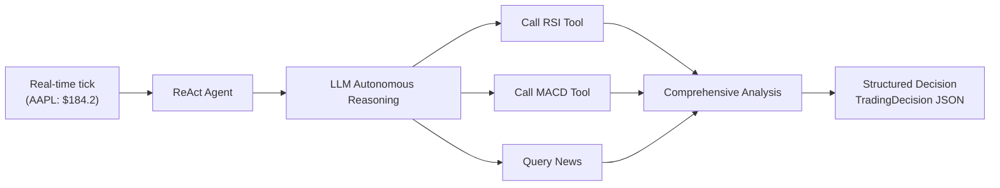
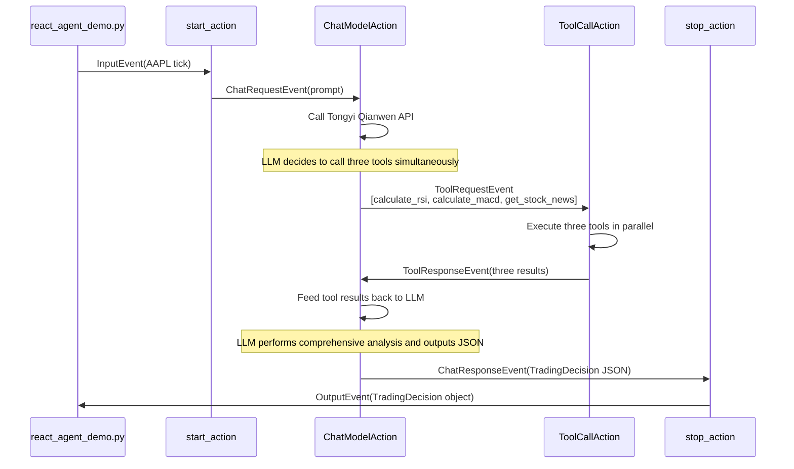
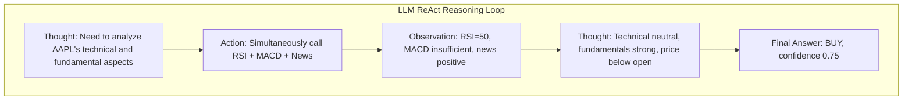

# Build a Smart Stock Analysis Agent in 60 Lines — Flink Agents ReAct Mode in Action

> This is the second article in the "Building an Intelligent Stock Trading System with Flink Agents" series. The [first article](article-1-principles.md) introduced the overall framework principles. This article demonstrates the practical usage of the ReAct Agent pattern through a minimal Demo.

---

## 1. Scenario and Objective

We are building a minimal intelligent stock analysis Agent: given a real-time tick (stock symbol, price, volume, etc.), it autonomously decides which analysis tools to invoke (RSI technical indicator, MACD momentum indicator, market news), and then outputs a structured trading decision (buy/sell/hold, confidence, suggested quantity, reason, risk level).

The entire Demo core code is roughly 60 lines, yet it fully demonstrates three core capabilities of Flink Agents: the ReAct reasoning-action loop, automatic metadata extraction for the tool system, and Pydantic-based structured output. The Demo supports both mock data and AKShare real market data as data sources, toggled via the `--source` command-line argument.



---

## 2. Data Modeling

Everything starts with the data model. We define two core models using Pydantic: the input tick data and the output trading decision.

```python
class StockTick(BaseModel):
    symbol: str
    price: float
    volume: int
    high: float
    low: float
    open_price: float
    timestamp: str

class TradingDecision(BaseModel):
    symbol: str = Field(description="Stock symbol")
    action: TradingAction = Field(description="Trading action: buy/sell/hold")
    confidence: float = Field(description="Confidence score 0.0-1.0")
    quantity: int = Field(description="Suggested trading quantity")
    reason: str = Field(description="Decision rationale")
    risk_level: str = Field(description="Risk level: low/medium/high")
```

`TradingDecision` has a special purpose: it serves as the `output_schema` parameter of the ReActAgent. As discussed in the [first article](article-1-principles.md), when `output_schema` is specified, the framework automatically injects the JSON Schema of this Pydantic model into the system prompt, requiring the LLM to output strictly in that format. Compared to manually writing "please output in the following JSON format" in the prompt, this approach is more reliable — the framework also automatically parses and validates the LLM response upon receipt.

Note the use of `Field(description=...)`: these descriptions appear in the generated JSON Schema, helping the LLM understand the meaning of each field. Clear descriptions directly impact the quality of the LLM's output.

---

## 3. Tool Functions

The core capability of the ReAct Agent comes from the tools it can invoke. We have prepared three tool functions for the Demo, all using mock data to avoid external dependencies.

There is a key requirement for defining tool functions: **they must use numpydoc-format docstrings**. This is not a code style preference but a requirement of the framework's metadata extraction mechanism. As covered in the [first article](article-1-principles.md) on the tool system's principles, the framework uses the `docstring_parser` library to extract parameter descriptions from the `Parameters` section of the docstring, and combines them with Python type annotations to generate the parameter Schema required by LLM function calling.

```python
def calculate_rsi(prices_json: str, period: int = 14) -> str:
    """Calculate the RSI (Relative Strength Index) technical indicator for a stock.

    Parameters
    ----------
    prices_json : str
        JSON string of historical price list, e.g. "[100.0, 101.5, 99.8, ...]"
    period : int
        RSI calculation period, default 14

    Returns
    -------
    str
        JSON string containing RSI value and interpretation
    """
    # ... mock RSI calculation logic ...
```

After the framework processes this docstring, the LLM will know: this tool is called `calculate_rsi`, its purpose is to "calculate the RSI technical indicator for a stock," and it accepts two parameters — a required price JSON string and an optional calculation period. The LLM can construct the correct invocation parameters during reasoning.

The other two tools are `calculate_macd` for calculating the MACD momentum indicator and `get_stock_news` for querying stock news. Their parameters and return values are all string types — this is the most stable choice when interfacing with LLM tool calls, avoiding unexpected type conversion issues.

---

## 4. Prompt Template

The prompt is the core element guiding LLM behavior. Flink Agents uses `Prompt.from_messages()` to construct prompt templates, supporting message-level role annotations and variable placeholders.

```python
react_agent_prompt = Prompt.from_messages(
    messages=[
        ChatMessage(
            role=MessageRole.SYSTEM,
            content="You are a professional stock trading analyst...",
        ),
        ChatMessage(
            role=MessageRole.USER,
            content="""Please analyze the following stock tick and provide trading advice:
Stock symbol: {symbol}
Current price: {price}
Volume: {volume}
High: {high}
Low: {low}
Open price: {open_price}
Timestamp: {timestamp}""",
        ),
    ],
)
```

Placeholders like `{symbol}`, `{price}` in the USER message are automatically replaced at runtime. The ReActAgent has an elegant design: when the input is a Pydantic BaseModel (such as `StockTick`), it automatically expands the model's fields into template variables. That is, `StockTick(symbol="AAPL", price=184.2, ...)` is automatically expanded to `{"symbol": "AAPL", "price": 184.2, ...}`, which then fills the corresponding placeholders in the prompt template. The developer does not need to do any manual formatting.

The system prompt explicitly tells the LLM its analysis workflow (first examine the tick, then calculate indicators, then check news, and finally make a decision), the output requirements (action/confidence/quantity/reason/risk_level), and key analysis rules (RSI < 30 oversold, > 70 overbought, etc.). These instructions, combined with the tool definitions, form the "reasoning" foundation of the ReAct loop.

---

## 5. Data Source and Assembly

### Data Source Switching

The Demo supports two data sources, toggled via the `--source` command-line argument. This design is implemented through a **proxy module** `data_source.py` — it exports exactly the same function interfaces as `mock_data.py` (`generate_stock_ticks`, `get_price_history_json`), and internally delegates to either the mock data or AKShare real market module based on a global setting. All Demo data consumption code simply imports from `data_source` without caring about which underlying data source is in use.

```python
from data_source import generate_stock_ticks, parse_args, set_source

args = parse_args()          # Parse --source and --symbols
set_source(args.source)      # Set global data source

symbols = args.symbols or ["AAPL", "TSLA"]
input_list = generate_stock_ticks(symbols, num_ticks=1)
```

When `--source real` is used, `real_data.py` fetches real US stock market data via AKShare: `stock_us_daily` for the latest daily candlestick data (Sina source), and `stock_news_em` for real-time news.

### Assembly and Execution

Once all components are ready, the assembly process is very concise.

```python
# 1. Create execution environment
env = AgentsExecutionEnvironment.get_execution_environment()

# 2. Register Tongyi Qianwen connection (environment-level resource)
env.add_resource("tongyi_conn", ResourceType.CHAT_MODEL_CONNECTION,
    ResourceDescriptor(clazz=ResourceName.ChatModel.TONGYI_CONNECTION))

# 3. Register tools (environment-level resources)
env.add_resource("calculate_rsi", ResourceType.TOOL, Tool.from_callable(calculate_rsi))
env.add_resource("calculate_macd", ResourceType.TOOL, Tool.from_callable(calculate_macd))
env.add_resource("get_stock_news", ResourceType.TOOL, Tool.from_callable(get_stock_news))

# 4. Create ReAct Agent
agent = ReActAgent(
    chat_model=ResourceDescriptor(
        clazz=ResourceName.ChatModel.TONGYI_SETUP,
        connection="tongyi_conn",
        model="qwen-plus",
        temperature=0.3,
        tools=["calculate_rsi", "calculate_macd", "get_stock_news"],
    ),
    prompt=react_agent_prompt,
    output_schema=TradingDecision,
)

# 5. Generate market data and execute
input_list = generate_stock_ticks(symbols, num_ticks=1)
output_list = env.from_list(input_list).apply(agent).to_list()
env.execute()
```

There are several noteworthy points here. Connections and tools are registered as environment-level resources via `env.add_resource()`, and can be shared across multiple Agents. The ReActAgent's `chat_model` parameter is a `ResourceDescriptor` — it only describes "use Tongyi Qianwen's qwen-plus model with three associated tools" without immediately creating any HTTP connection. The `from_list().apply().to_list()` chain is the standard local debugging pattern: convert the input list into an event stream, process it through the Agent, and collect the output.

During execution, the framework automatically handles the following: wrapping each `StockTick` as an `InputEvent`, triggering the ReActAgent's built-in `start_action`, constructing the prompt and sending a `ChatRequestEvent`, calling the Tongyi Qianwen API, automatically executing the corresponding tools when the LLM returns `tool_calls` and feeding the results back to the LLM, until the LLM outputs the final answer, which is then wrapped as an `OutputEvent` by `stop_action`.



---

## 6. Interpreting the Results

The Demo supports two execution modes:

```bash
python react_agent_demo.py                                  # Mock data (default)
python react_agent_demo.py --source real                    # Real US market data (default AAPL + TSLA)
python react_agent_demo.py --source real --symbols NVDA     # Specify US stock
```

Running with mock data produces the following output (abbreviated):

```
Demo 1: ReAct Agent — Intelligent Stock Analysis [Data source: demo]

Input 2 market data ticks:
  [AAPL] Price=184.2 Volume=4744823
  [TSLA] Price=238.77 Volume=5231769

Trading Decision Results:

  [AAPL] symbol='AAPL' action=BUY confidence=0.75 quantity=100
         reason='News sentiment is generally positive, Vision Pro 2 launch and iPhone sales exceeded expectations;
                RSI is neutral at 50, but fundamentals are strong, current price below open price offers good value.'
         risk_level='medium'

  [TSLA] symbol='TSLA' action=BUY confidence=0.65 quantity=85
         reason='RSI is 50, neutral; MACD not calculated due to insufficient data; news is generally positive,
                autonomous driving and energy storage business tailwinds offset price war pressure, current price near intraday low.'
         risk_level='medium'
```

Switching to real US market data (`--source real --symbols NVDA`), the output becomes:

```
Demo 1: ReAct Agent — Intelligent Stock Analysis [Data source: real]

Input 1 market data tick:
  [NVDA] Price=148.85 Volume=198623300

Trading Decision Results:

  [NVDA] symbol='NVDA' action=BUY confidence=0.72 quantity=80
         reason='RSI is in a neutral-to-strong range; news sentiment is generally positive, GPU demand continues to grow;
                current price is in a reasonable range, suitable for position building.'
         risk_level='medium'
```

The LLM's reasoning process can be observed from the run logs. Faced with AAPL's tick data, the LLM decided in its first reasoning round to call **all three tools simultaneously** — this is the parallel tool calling capability supported by Tongyi Qianwen. The framework executed `calculate_rsi`, `calculate_macd`, and `get_stock_news` concurrently and returned all three results to the LLM. In the second reasoning round, the LLM synthesized the results from all three tools (RSI=50 neutral, MACD insufficient data, news generally positive) and made a BUY decision with a confidence of 0.75.

The entire process demonstrates the core characteristics of the ReAct loop: the LLM does not blindly call all tools sequentially, but instead determines which information is needed based on reasoning and autonomously decides on the invocation strategy. If a different stock were used (for example, one not covered in the news database), the LLM might choose to skip the news query and rely solely on technical indicators for its judgment.



The output `TradingDecision` is a Pydantic-validated structured object, not a raw JSON string. This means downstream systems can directly access fields like `decision.action`, `decision.confidence`, etc., without additional parsing. If the LLM's output does not conform to the Schema (for example, if a required field is missing), the framework will automatically attempt correction or report an error, preventing dirty data from flowing into subsequent processing.

---

## 7. Summary

This Demo, with only 60 lines of core code, showcases four key capabilities of Flink Agents. The ReAct pattern gives the LLM full control over the tool invocation strategy, and developers do not need to write any event handling logic. The tool system automatically extracts metadata via numpydoc docstrings, seamlessly transforming ordinary Python functions into tools callable by the LLM. Structured output constrains the LLM's free-text responses into reliable Pydantic objects through `output_schema`. The data source proxy pattern allows the Demo to switch seamlessly between mock data and real market data, with the same Agent code requiring zero modifications.

However, the ReAct Agent also has clear limitations. It only supports a single-model, single-round "reasoning-action" loop and cannot implement multi-stage processing pipelines (for example, performing technical analysis first, then making a trading decision). It has no cross-run memory capability and cannot track position status. It also does not support orchestrating custom event flows within the Agent.

These limitations are precisely where the Workflow Agent excels. In the [next article](article-3-workflow-agent.md), we will build a comprehensive stock trading decision Agent with dual models, two-stage processing, memory, and Skills, fully demonstrating the complete programming capabilities of Flink Agents.