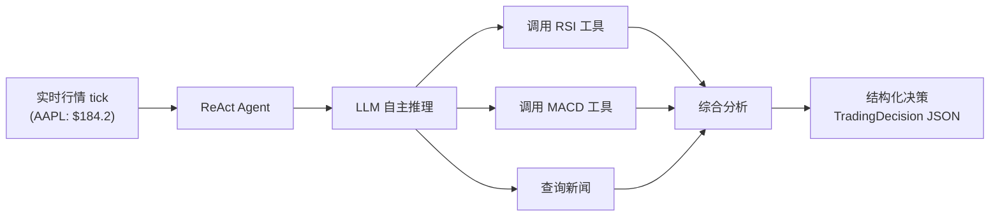
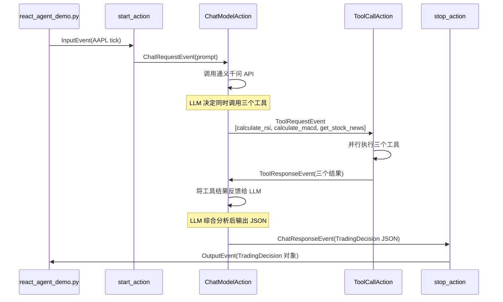
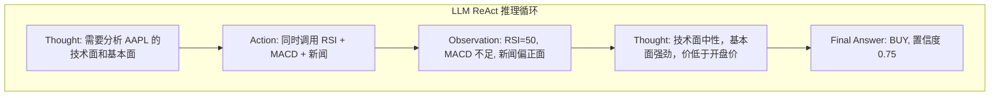

# 用 60 行代码构建智能股票分析 Agent — Flink Agents ReAct 模式实战

> 本文是"基于 Flink Agents 构建智能股票交易系统"系列的第二篇。[第一篇](article-1-principles.zh.md)介绍了框架的整体原理，本篇将通过一个最简 Demo 展示 ReAct Agent 模式的实战用法。

---

## 一、场景与目标

我们要构建的是一个最简单的智能股票分析 Agent：给它一条实时行情数据（股票代码、价格、成交量等），它自主决定调用哪些分析工具（RSI 技术指标、MACD 动量指标、市场新闻），然后输出一个结构化的交易决策（买入/卖出/持有、置信度、建议数量、理由、风险等级）。

整个 Demo 的核心代码只有约 60 行，但它完整展示了 Flink Agents 的三个核心能力：ReAct 推理-行动循环、工具系统的自动元数据提取，以及基于 Pydantic 的结构化输出。Demo 支持模拟数据和 AKShare 真实行情两种数据源，通过命令行参数 `--source` 切换。



---

## 二、数据建模

一切从数据模型开始。我们用 Pydantic 定义两个核心模型：输入的行情数据和输出的交易决策。

```python
class StockTick(BaseModel):
    symbol: str
    price: float
    volume: int
    high: float
    low: float
    open_price: float
    timestamp: str

class TradingDecision(BaseModel):
    symbol: str = Field(description="股票代码")
    action: TradingAction = Field(description="交易动作: buy/sell/hold")
    confidence: float = Field(description="置信度 0.0-1.0")
    quantity: int = Field(description="建议交易数量")
    reason: str = Field(description="决策理由")
    risk_level: str = Field(description="风险等级: low/medium/high")
```

`TradingDecision` 的设计有一个特别的用途：它将作为 ReActAgent 的 `output_schema` 参数。回顾[第一篇](article-1-principles.zh.md)的原理，当指定 `output_schema` 时，框架会将这个 Pydantic 模型的 JSON Schema 自动注入到系统提示词中，要求 LLM 严格按照该格式输出。相比手动在 prompt 里写"请按以下 JSON 格式输出"，这种方式更可靠——框架在接收到 LLM 响应后还会自动解析并验证。

注意 `Field(description=...)` 的写法：这些描述信息会出现在生成的 JSON Schema 中，帮助 LLM 理解每个字段的含义。清晰的 description 直接影响 LLM 输出的质量。

---

## 三、工具函数

ReAct Agent 的核心能力来自于它可以调用的工具。我们为 Demo 准备了三个工具函数，全部使用模拟数据以避免外部依赖。

工具函数的定义有一个关键要求：**必须使用 numpydoc 格式的 docstring**。这不是代码风格偏好，而是框架的元数据提取机制所要求的。回顾[第一篇](article-1-principles.zh.md)中工具系统的原理，框架使用 `docstring_parser` 库从 docstring 的 `Parameters` 段落中提取每个参数的描述，配合 Python 类型注解生成 LLM function calling 所需的参数 Schema。

```python
def calculate_rsi(prices_json: str, period: int = 14) -> str:
    """计算股票的 RSI（相对强弱指数）技术指标。

    Parameters
    ----------
    prices_json : str
        历史价格列表的 JSON 字符串，例如 "[100.0, 101.5, 99.8, ...]"
    period : int
        RSI 计算周期，默认 14

    Returns
    -------
    str
        包含 RSI 值和解读的 JSON 字符串
    """
    # ... 模拟 RSI 计算逻辑 ...
```

这段 docstring 经过框架处理后，LLM 会知道：这个工具叫 `calculate_rsi`，用途是"计算股票的 RSI 技术指标"，接受两个参数——一个必填的价格 JSON 字符串和一个可选的计算周期。LLM 在推理过程中就能正确构造调用参数。

另外两个工具 `calculate_macd` 计算 MACD 动量指标，`get_stock_news` 查询股票新闻。它们的参数和返回值都是字符串类型——这是与 LLM 工具调用对接时最稳定的选择，避免了类型转换的意外。

---

## 四、Prompt 模板

Prompt 是引导 LLM 行为的核心。Flink Agents 使用 `Prompt.from_messages()` 构建提示词模板，支持消息级的角色标注和变量占位符。

```python
react_agent_prompt = Prompt.from_messages(
    messages=[
        ChatMessage(
            role=MessageRole.SYSTEM,
            content="你是一位专业的股票交易分析师...",
        ),
        ChatMessage(
            role=MessageRole.USER,
            content="""请分析以下股票行情并给出交易建议:
股票代码: {symbol}
当前价格: {price}
成交量: {volume}
最高价: {high}
最低价: {low}
开盘价: {open_price}
时间: {timestamp}""",
        ),
    ],
)
```

USER 消息中的 `{symbol}`、`{price}` 等占位符会在运行时被自动替换。ReActAgent 有一个巧妙的设计：当输入是 Pydantic BaseModel（如 `StockTick`）时，它会自动将模型的各字段展开为模板变量。也就是说，`StockTick(symbol="AAPL", price=184.2, ...)` 会被自动展开为 `{"symbol": "AAPL", "price": 184.2, ...}`，然后填充到 prompt 模板的对应占位符中。开发者不需要手动做任何格式化。

系统提示词中明确告诉 LLM 它的分析流程（先看行情、再算指标、再查新闻、最后决策）和输出要求（action/confidence/quantity/reason/risk_level），以及关键的分析规则（RSI < 30 超卖、> 70 超买等）。这些指示与工具定义配合，构成了 ReAct 循环的"推理"基础。

---

## 五、数据源与组装

### 数据源切换

Demo 支持两种数据源，通过命令行参数 `--source` 切换。这个设计通过一个**代理模块** `data_source.py` 实现——它导出与 `mock_data.py` 完全相同的函数接口（`generate_stock_ticks`、`get_price_history_json`），内部根据全局设置委托到模拟数据或 AKShare 真实行情模块。所有 Demo 的数据消费代码只需从 `data_source` 导入，无需关心底层是哪个数据源。

```python
from data_source import generate_stock_ticks, parse_args, set_source

args = parse_args()          # 解析 --source 和 --symbols
set_source(args.source)      # 设置全局数据源

symbols = args.symbols or ["AAPL", "TSLA"]
input_list = generate_stock_ticks(symbols, num_ticks=1)
```

当 `--source real` 时，`real_data.py` 通过 AKShare 获取美股真实行情：使用 `stock_us_daily` 获取最新日线数据（Sina 源），`stock_news_em` 获取实时新闻。

### 组装与运行

所有组件就绪后，组装过程非常简洁。

```python
# 1. 创建执行环境
env = AgentsExecutionEnvironment.get_execution_environment()

# 2. 注册通义千问连接（环境级资源）
env.add_resource("tongyi_conn", ResourceType.CHAT_MODEL_CONNECTION,
    ResourceDescriptor(clazz=ResourceName.ChatModel.TONGYI_CONNECTION))

# 3. 注册工具（环境级资源）
env.add_resource("calculate_rsi", ResourceType.TOOL, Tool.from_callable(calculate_rsi))
env.add_resource("calculate_macd", ResourceType.TOOL, Tool.from_callable(calculate_macd))
env.add_resource("get_stock_news", ResourceType.TOOL, Tool.from_callable(get_stock_news))

# 4. 创建 ReAct Agent
agent = ReActAgent(
    chat_model=ResourceDescriptor(
        clazz=ResourceName.ChatModel.TONGYI_SETUP,
        connection="tongyi_conn",
        model="qwen-plus",
        temperature=0.3,
        tools=["calculate_rsi", "calculate_macd", "get_stock_news"],
    ),
    prompt=react_agent_prompt,
    output_schema=TradingDecision,
)

# 5. 生成行情数据并执行
input_list = generate_stock_ticks(symbols, num_ticks=1)
output_list = env.from_list(input_list).apply(agent).to_list()
env.execute()
```

这里有几个要点值得注意。连接和工具通过 `env.add_resource()` 注册为环境级资源，可以被多个 Agent 共享。`ReActAgent` 的 `chat_model` 参数是一个 `ResourceDescriptor`——它只描述了"使用通义千问的 qwen-plus 模型、关联三个工具"，并不会立即创建任何 HTTP 连接。`from_list().apply().to_list()` 是本地调试的标准模式：将输入列表转为事件流，经过 Agent 处理后收集输出。

执行过程中，框架自动完成了以下工作：将每个 `StockTick` 包装为 `InputEvent`，触发 ReActAgent 内置的 `start_action`，构造 prompt 并发送 `ChatRequestEvent`，调用通义千问 API，当 LLM 返回 `tool_calls` 时自动执行对应工具并将结果反馈给 LLM，直到 LLM 输出最终答案后由 `stop_action` 封装为 `OutputEvent`。



---

## 六、运行结果解读

Demo 支持两种运行方式：

```bash
python react_agent_demo.py                                  # 模拟数据（默认）
python react_agent_demo.py --source real                    # 美股真实行情（默认 AAPL + TSLA）
python react_agent_demo.py --source real --symbols NVDA     # 指定美股
```

使用模拟数据运行后，输出如下（精简版）：

```
Demo 1: ReAct Agent — 智能股票分析 [数据源: demo]

输入 2 条行情数据:
  [AAPL] 价格=184.2 成交量=4744823
  [TSLA] 价格=238.77 成交量=5231769

交易决策结果:

  [AAPL] symbol='AAPL' action=BUY confidence=0.75 quantity=100
         reason='新闻情绪偏正面，Vision Pro 2发布及iPhone销量超预期；
                RSI为50中性，但基本面强劲，当前价低于开盘价具性价比。'
         risk_level='medium'

  [TSLA] symbol='TSLA' action=BUY confidence=0.65 quantity=85
         reason='RSI为50，中性；MACD因数据不足未计算；新闻整体偏正面，
                自动驾驶与储能业务利好抵消价格战压力，当前价接近日内低点。'
         risk_level='medium'
```

切换到美股真实行情（`--source real --symbols NVDA`），输出变为：

```
Demo 1: ReAct Agent — 智能股票分析 [数据源: real]

输入 1 条行情数据:
  [NVDA] 价格=148.85 成交量=198623300

交易决策结果:

  [NVDA] symbol='NVDA' action=BUY confidence=0.72 quantity=80
         reason='RSI处于中性偏强区间；新闻情绪偏正面，GPU需求持续增长；
                当前价格处于合理区间，适合建仓。'
         risk_level='medium'
```

从运行日志可以观察到 LLM 的推理过程。面对 AAPL 的行情数据，LLM 在第一轮推理中决定**同时**调用三个工具——这是通义千问支持的并行工具调用能力。框架同时执行了 `calculate_rsi`、`calculate_macd` 和 `get_stock_news`，将三个结果一并返回给 LLM。LLM 在第二轮推理中综合三个工具的结果（RSI=50 中性、MACD 数据不足、新闻偏正面），做出了 BUY 的决策，置信度 0.75。

整个过程展示了 ReAct 循环的核心特征：LLM 不是盲目地依次调用所有工具，而是根据推理判断需要哪些信息，自主决定调用策略。如果换一只不同的股票（比如新闻库中没有覆盖的），LLM 可能会选择跳过新闻查询，只依靠技术指标做判断。



输出的 `TradingDecision` 是一个经过 Pydantic 验证的结构化对象，不是裸的 JSON 字符串。这意味着下游系统可以直接访问 `decision.action`、`decision.confidence` 等字段，无需额外解析。如果 LLM 的输出不符合 Schema（比如漏掉了某个必填字段），框架会自动尝试纠正或报错，避免脏数据流入后续流程。

---

## 七、小结

这个仅 60 行核心代码的 Demo 展示了 Flink Agents 的四个关键能力。ReAct 模式让 LLM 自主掌控工具调用策略，开发者无需编写任何事件处理逻辑。工具系统通过 numpydoc docstring 自动提取元数据，将普通 Python 函数无缝转化为 LLM 可调用的工具。结构化输出通过 `output_schema` 将 LLM 的自由文本响应约束为可靠的 Pydantic 对象。数据源代理模式让 Demo 在模拟数据和真实行情之间无缝切换，同一套 Agent 代码无需任何修改。

但 ReAct Agent 也有明显的局限。它只支持单模型、单轮的"推理-行动"循环，无法实现多阶段的处理流水线（比如先做技术分析、再做交易决策）。它没有跨次运行的记忆能力，无法追踪持仓状态。它也不支持在 Agent 内部编排自定义的事件流。

这些局限恰恰是 Workflow Agent 的用武之地。在[下一篇](article-3-workflow-agent.zh.md)中，我们将构建一个双模型、两阶段、带记忆和 Skills 的综合股票交易决策 Agent，充分展示 Flink Agents 的全部编程能力。
