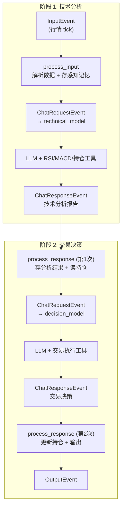
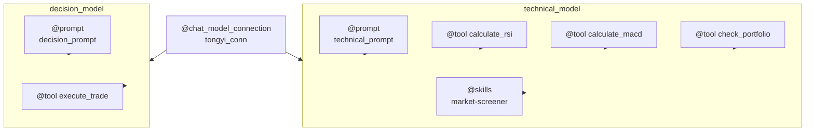
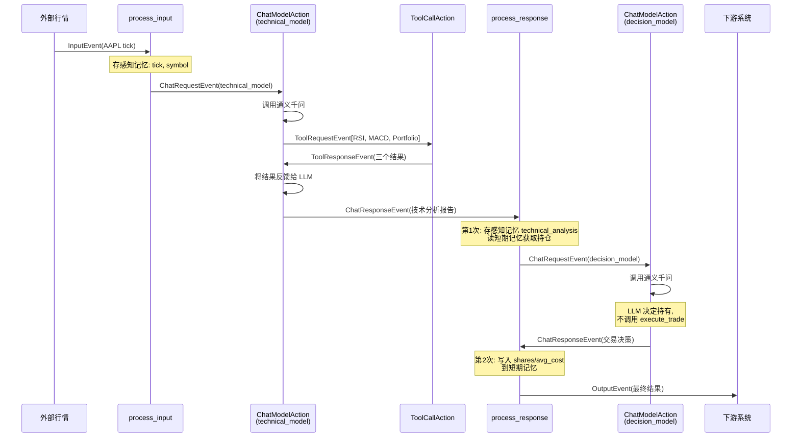
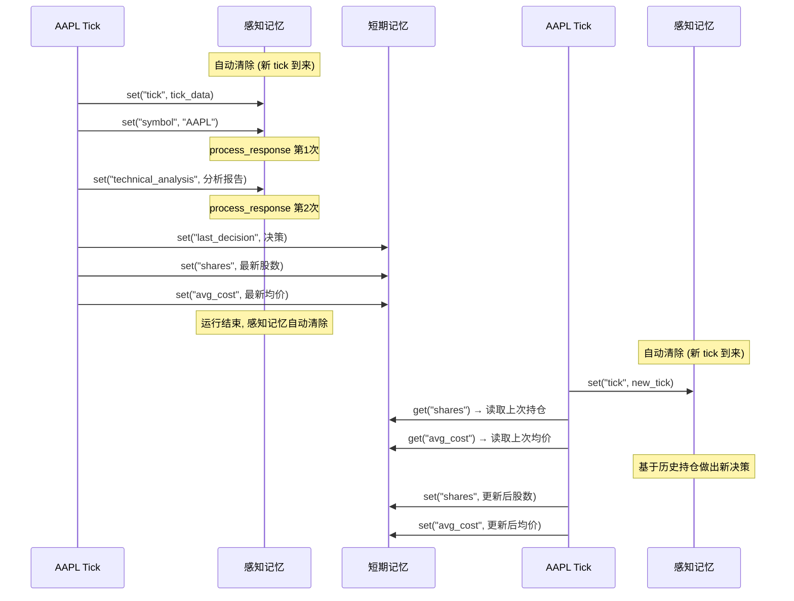

# Building a Multi-Stage Stock Trading Decision System — Flink Agents Workflow Mode in Action

> This is the third article in the "Building an Intelligent Stock Trading System with Flink Agents" series. The [first article](article-1-principles.md) introduced the framework's principles, while the [second article](article-2-react-agent.md) used a ReAct Agent to implement a minimal single-round analysis. This article builds a comprehensive Workflow Agent, demonstrating the full programming capabilities of the framework.

---

## 1. Why Workflow Agent

While the ReAct Agent from the previous article is simple and elegant, it is essentially a "general practitioner" — using the same model, the same set of tools, and a single round of reasoning to handle everything. In real trading scenarios, this model has three clear limitations.

The first is **responsibility confusion**. Technical analysis and trading decisions are two fundamentally different tasks: the former requires冷静 objectively calculating indicators and assessing trends, while the latter requires synthesizing results and portfolio status to make a final judgment. Stuffing both tasks into the same prompt and the same set of tools makes it easy for the model to lose focus.

The second is **lack of memory**. Once the ReAct Agent processes a tick, it forgets everything. It doesn't know what decision it made for the same stock last time, nor does it know the current portfolio holdings. Every analysis starts "from scratch."

The third is **lack of controllability**. The ReAct reasoning process is entirely driven by the LLM autonomously, leaving developers unable to intervene in intermediate steps — for example, to enforce that "technical analysis must be completed before making a trading decision."

The Workflow Agent is designed to address precisely these issues. It allows developers to customize event processing chains using the `@action` decorator, configure multiple independent model instances (each with its own prompt and tools), and leverage a three-tier memory system to pass state between Actions and across multiple runs.



---

## 2. Agent Class Skeleton and Decorators

A Workflow Agent is built by inheriting from the `Agent` base class and using a set of decorators to declare resources and behaviors. The structure of the `StockTradingAgent` class can be divided into two main parts: "resource declaration" and "event handling."

Resource declaration starts with the underlying connection. The `@chat_model_connection` decorator declares the API connection configuration for Tongyi Qianwen (Qwen), which serves as the shared infrastructure for all subsequent model instances. On top of that, the `@prompt` decorator defines two prompt templates — `technical_prompt` guides the LLM in performing technical indicator analysis, while `decision_prompt` guides the LLM in making trading decisions. The `@tool` decorator registers four tool functions: `calculate_rsi` and `calculate_macd` for the technical analysis phase, `check_portfolio` for querying current holdings, and `execute_trade` for executing simulated trades.

The most critical elements are the two `@chat_model_setup` decorators, which assemble the connection, prompt, and tools into two complete model configurations. `technical_model` binds the technical analysis prompt and three analysis tools (RSI, MACD, portfolio query), and also enables the `market-screener` skill. `decision_model` binds the decision prompt and the trade execution tool. Both models share the same connection but have entirely independent behavioral patterns.



The `@skills` decorator loads a local skill directory via `Skills.from_local_dir("./skills")`. The workings of the skill system were detailed in the [first article](article-1-principles.md) — only the skill name and description are loaded at startup, and the LLM calls the `load_skill` built-in tool on demand to retrieve the full content.

At the code level, each decorator method is a `@staticmethod` that returns a `ResourceDescriptor` or a corresponding resource object. These methods are called once during the compilation phase to extract resource descriptions and are not executed at runtime.

```python
class StockTradingAgent(Agent):
    @chat_model_connection
    @staticmethod
    def tongyi_conn() -> ResourceDescriptor:
        return ResourceDescriptor(clazz=ResourceName.ChatModel.TONGYI_CONNECTION)

    @chat_model_setup
    @staticmethod
    def technical_model() -> ResourceDescriptor:
        return ResourceDescriptor(
            clazz=ResourceName.ChatModel.TONGYI_SETUP,
            connection="tongyi_conn",
            model="qwen-plus",
            prompt="technical_prompt",
            tools=["calculate_rsi", "calculate_macd", "check_portfolio"],
            skills=["market-screener"],
            # ...
        )

    @chat_model_setup
    @staticmethod
    def decision_model() -> ResourceDescriptor:
        return ResourceDescriptor(
            clazz=ResourceName.ChatModel.TONGYI_SETUP,
            connection="tongyi_conn",
            model="qwen-plus",
            prompt="decision_prompt",
            tools=["execute_trade"],
            # ...
        )
    # ... tool, prompt, and other decorators omitted ...
```

---

## 3. Design Philosophy Behind the Dual-Model Configuration

Why use two model configurations instead of one? The core motivation behind this design is **separation of responsibilities**.

The system prompt for `technical_model` tells the LLM "you are a stock technical analyst," directing it to call RSI and MACD tools to compute indicators, check portfolio holdings, and ultimately produce a technical analysis conclusion. This model's toolset includes only analysis tools, not trade execution tools — meaning the LLM **cannot** overstep its authority to execute trades during the technical analysis phase.

The system prompt for `decision_model` tells the LLM "you are a trading decision expert," providing it with the technical analysis results from the previous phase and the current portfolio, and asking it to make a buy/sell/hold decision. If it decides to trade, it can call the `execute_trade` tool to place the order.

The benefit of this separation goes beyond making prompts more focused (each model only needs to understand its own responsibilities). More importantly, it creates a **security boundary** — by controlling the toolset available to each model, the architecture prevents the risk of "accidental trade execution during the analysis phase."

---

## 4. Event Chain Orchestration

The core of the Workflow Agent consists of two `@action` methods — `process_input` and `process_response` — which define the complete event processing chain for the agent.

`process_input` listens for `InputEvent` and serves as the entry point of the agent's processing. It parses the market tick data from the event, stores the raw data in sensory memory (for use in subsequent phases), constructs an analysis request with historical price data, and finally sends a `ChatRequestEvent` specifying `model="technical_model"` to trigger the technical analysis.

```python
from data_source import get_price_history_json  # Proxy module, auto-delegates to mock or real

@action(InputEvent.EVENT_TYPE)
@staticmethod
def process_input(event: Event, ctx: RunnerContext) -> None:
    input_data = InputEvent.from_event(event).input
    tick_dict = input_data.model_dump()
    symbol = tick_dict.get("symbol", "UNKNOWN")

    ctx.sensory_memory.set("tick", json.dumps(tick_dict, ensure_ascii=False))
    ctx.sensory_memory.set("symbol", symbol)

    prices_json = get_price_history_json(symbol)
    tick_info = json.dumps(tick_dict, ensure_ascii=False)
    content = f"Market data: {tick_info}\nHistorical prices (for technical indicator calculation): {prices_json}"

    ctx.send_event(ChatRequestEvent(
        model="technical_model",
        messages=[ChatMessage(role=MessageRole.USER)],
        prompt_args={"input": content},
    ))
```

Here, `get_price_history_json` comes from the `data_source` proxy module. When the user specifies `--source real`, it retrieves real historical daily closing prices for US stocks via AKShare's `stock_us_daily`; the default `--source demo` returns deterministically randomly generated simulated prices. This switching is completely transparent to `process_input` — it only cares about receiving a price JSON string, not where the data comes from.

`process_response` listens for `ChatResponseEvent`, but it needs to handle **two** different responses — the technical analysis result from `technical_model` and the trading decision from `decision_model`. There is an elegant design choice here: since `ChatResponseEvent` does not carry an identifier indicating "which model it came from," the code distinguishes between the two phases by checking whether `technical_analysis` already exists in sensory memory.

```python
from tools import get_portfolio_state  # Reads portfolio state from tool layer

@action(ChatResponseEvent.EVENT_TYPE)
@staticmethod
def process_response(event: Event, ctx: RunnerContext) -> None:
    response_content = ChatResponseEvent.from_event(event).response.content

    if not ctx.sensory_memory.is_exist("technical_analysis"):
        # ---- 1st response: technical analysis completed ----
        ctx.sensory_memory.set("technical_analysis", response_content)

        # Read historical portfolio from short-term memory; fall back to tool layer initial value on first tick
        portfolio_info = "No holdings on record"
        if ctx.short_term_memory.is_exist("shares"):
            shares = ctx.short_term_memory.get("shares")
            avg_cost = ctx.short_term_memory.get("avg_cost")
            if shares > 0:
                portfolio_info = f"Holding {shares} shares, avg cost ${avg_cost}"
        else:
            portfolio = get_portfolio_state(symbol)
            if portfolio["shares"] > 0:
                portfolio_info = f"Holding {portfolio['shares']} shares, avg cost ${portfolio['avg_cost']}"

        ctx.send_event(ChatRequestEvent(
            model="decision_model",
            prompt_args={
                "technical_analysis": response_content,
                "portfolio": portfolio_info,
                "tick": ctx.sensory_memory.get("tick"),
            },
            # ...
        ))
    else:
        # ---- 2nd response: trading decision completed ----
        ctx.short_term_memory.set("last_decision", response_content)
        # Write latest portfolio to short-term memory (execute_trade has updated tool layer state)
        portfolio = get_portfolio_state(symbol)
        ctx.short_term_memory.set("shares", portfolio["shares"])
        ctx.short_term_memory.set("avg_cost", portfolio["avg_cost"])
        # ... construct output and send OutputEvent ...
```

The following sequence diagram illustrates the complete event flow for a single processing cycle, including the participation of the framework's built-in Actions:



---

## 5. Memory System in Practice

In this demo, sensory memory and short-term memory each take on clear responsibilities.

**Sensory memory** serves two purposes in this demo. First, it passes data across Actions: `process_input` stores the raw tick data and symbol in sensory memory, and `process_response` reads them from sensory memory when constructing the decision request, avoiding the need to pass data through event attributes layer by layer. Second, it acts as a phase marker: `ctx.sensory_memory.is_exist("technical_analysis")` determines whether the current `ChatResponseEvent` is the first or second occurrence. Sensory memory is automatically cleared when a new `InputEvent` arrives, so no dirty data lingers across ticks.

**Short-term memory** persists portfolio state across ticks. In phase 2 of `process_response`, after the trading decision is completed, the latest share count and average cost are read from the tool layer via `get_portfolio_state()` and written to the `shares` and `avg_cost` fields in short-term memory. When the next tick for the same key arrives, phase 1 reads this data from short-term memory as the portfolio input for the decision model. This ensures that the portfolio information returned by the `check_portfolio` tool stays consistent with the `portfolio` parameter passed to the decision model, preventing the LLM from seeing contradictory portfolio data.

For the first tick (when short-term memory is empty), the code falls back to `get_portfolio_state()` to read the initial portfolio values from the tool layer, ensuring correct portfolio information is provided even without historical memory.

In distributed mode, short-term memory is implemented on top of Flink's Keyed MapState, partitioned and stored by key (stock ticker), so memory for different stocks does not interfere with each other.



You might ask: why not use Python variables instead of memory? While this would work in local debug mode, in Flink's distributed mode, different ticks for the same stock may be scheduled to different nodes, and Python variables cannot be shared across nodes. More importantly, Flink's checkpoint mechanism can only persist data in Keyed State — if critical state is stored in Python variables, that data is lost after a failure recovery. Using the framework's memory API is the prerequisite for correct distributed fault tolerance.

---

## 6. Skills Integration

The Skills system is demonstrated in this demo through the `market-screener` skill. This skill describes a set of stock screening and scoring rules based on RSI, MACD, and trading volume.

A skill is defined as a `SKILL.md` file located in the `skills/market-screener/` directory. The YAML frontmatter at the top of the file declares the skill's name and a brief description, while the markdown body contains the detailed screening rules and scoring methodology.

```yaml
---
name: market-screener
description: 使用技术指标筛选股票。当需要评估股票是否符合特定技术面条件时使用此技能。
---

# Market Screening Skill
## Screening Rules
### 1. RSI Screening
- RSI < 30: Oversold — Marked as buy candidate
- RSI > 70: Overbought — Marked as sell candidate
### 2. MACD Screening
- MACD Golden Cross: Buy signal
- MACD Death Cross: Sell signal
## Composite Score
Combine the three dimensions into a 0-3 composite score...
```

In the agent code, skill integration is completed in two steps. The `@skills` decorator registers the skill directory as a resource, and the `skills=["market-screener"]` parameter in `@chat_model_setup` associates this skill with `technical_model`. The framework injects only the skill name and description into the system prompt at startup (approximately 100 tokens). When the LLM decides it needs to reference the screening rules during analysis, it proactively calls the framework's built-in `load_skill` tool to load the full content. This on-demand loading avoids filling the context window with detailed descriptions of all skills.

---

## 7. Interpreting the Results

The demo supports three modes of operation:

```bash
python workflow_agent_demo.py                                              # Simulated data (default)
python workflow_agent_demo.py --source real                                # Real US stock data (default AAPL + TSLA)
python workflow_agent_demo.py --source real --symbols NVDA                 # Specify a US stock
python workflow_agent_demo.py --source real --symbols NVDA --interval 60   # Continuous monitoring (refresh every 60s)
```

In **simulated data mode**, after running `workflow_agent_demo.py`, the agent sequentially processes two ticks for AAPL and TSLA, each undergoing the full two-phase processing.

For AAPL (price 184.2, open 184.85), the technical analysis phase output shows: RSI is in the neutral zone, MACD shows a bearish signal (death cross + negative histogram), current holdings of 50 shares at an average cost of 178.5, with an unrealized profit of $325. The portfolio information received by the decision model is consistent with what the `check_portfolio` tool returned — both data sources show "Holding 50 shares, avg cost $178.5." This consistency comes from the dual-layer synchronization mechanism for portfolio state: the `execute_trade` tool updates the module-level `_portfolio_db` when executing a trade, and `process_response` phase 2 then writes the latest holdings to short-term memory.

After comprehensive analysis, the decision model chose **partial profit-taking** — selling 30 shares to lock in some profit and reduce portfolio risk, while retaining a 20-share base position. The `execute_trade` tool automatically updated the portfolio state after executing the trade: AAPL went from 50 shares down to 20 shares, with the average cost remaining at $178.5. This decision demonstrates the advantage of the dual-model division of labor — the technical analysis model objectively presented the bearish MACD signal, and the decision model made a prudent position-reduction decision based on that analysis.

In **real market data mode** (`--source real --symbols NVDA`), the agent uses AKShare to fetch NVIDIA's latest daily candlestick and 30-day historical closing prices. The technical analysis phase calculates RSI and MACD indicators based on real historical prices, with no current holdings. The decision model makes a buy or hold recommendation based on the technical signals and market news.

In **continuous monitoring mode** (`--interval N`), the agent fetches the latest market data every N seconds and re-analyzes it. At the start of each round, the price cache is cleared to ensure the latest data is retrieved, then a new execution environment is created to run the full two-phase analysis. The continuous monitoring mode prints round numbers and timestamps, and stops gracefully on Ctrl+C. This mode demonstrates the demo's extensibility from one-shot analysis to real-time monitoring — in a production environment, the same agent code can directly connect to Flink's `from_datastream()` to consume real-time Kafka market data streams without any modifications.

The processing of the two ticks also demonstrates the observability of the runtime logs. Every event sent and every Action executed has a corresponding log entry, allowing you to clearly trace the complete event chain: "process_input sent ChatRequestEvent → technical_model called three tools → process_response stored analysis results (1st time) → decision_model made a decision → process_response updated portfolio and output final results (2nd time)."

---

## 8. Summary

This demo comprehensively showcases the core capabilities of the Flink Agents framework. The `@action` decorator gives developers full control over the event flow, and the two-phase processing chain demonstrates the orchestration flexibility of the Workflow Agent. The dual `@chat_model_setup` achieves model responsibility separation, providing a security boundary at the architectural level. Sensory memory passes intermediate state between Actions and serves as a phase marker, while short-term memory persists portfolio data across ticks — `execute_trade` updates the tool layer's `_portfolio_db`, and `process_response` phase 2 then synchronizes the latest portfolio to short-term memory, ensuring the LLM always sees consistent portfolio information. The `@skills` integration demonstrates a progressive capability discovery mechanism. The four `@tool` decorators show how to register tools directly inside the Agent class — compared to Demo 1's environment-level registration (`env.add_resource`), the decorator approach binds tools more tightly to the Agent. The data source proxy layer allows the same agent code to seamlessly switch between simulated data and real market data. The continuous monitoring mode (`--interval N`) demonstrates an extensible path from one-shot analysis to periodic monitoring — the same agent code can be connected to Flink's real-time data streams without any modifications.

However, you may have noticed that in Demo 2, a large amount of resource declaration code (connections, prompts, tools, model configurations) is mixed together with the processing logic in the same Python file. For scenarios where you need to frequently adjust configurations (switch models, change prompts, add or remove tools) without touching the processing logic, is there a better approach? This is precisely where YAML declarative configuration shines. The [next article](article-4-yaml-agent.md) will demonstrate how to convert the same agent logic to a YAML configuration, achieving "zero-Python resource definitions."