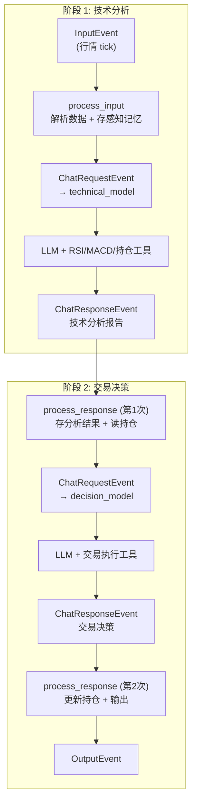
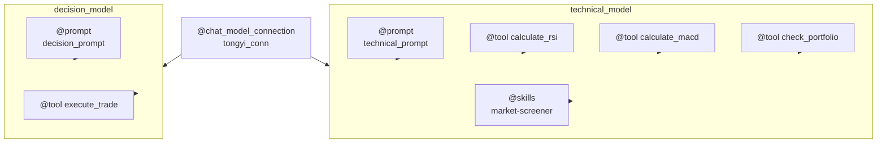
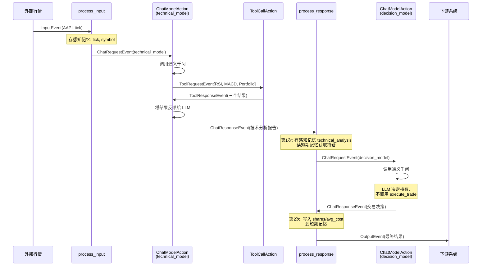
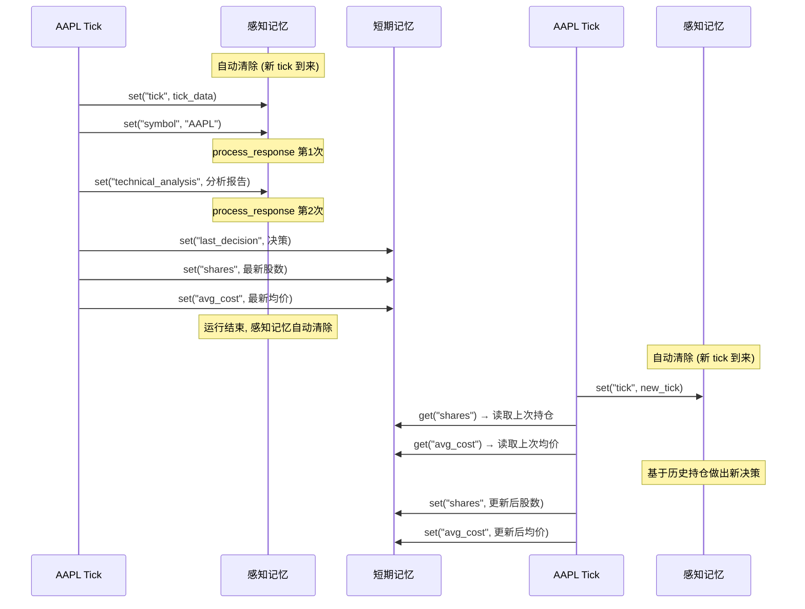

# 构建多阶段股票交易决策系统 — Flink Agents Workflow 模式实战

> 本文是"基于 Flink Agents 构建智能股票交易系统"系列的第三篇。[第一篇](article-1-principles.zh.md)介绍了框架原理，[第二篇](article-2-react-agent.zh.md)用 ReAct Agent 实现了最简的单轮分析。本篇将构建一个综合性的 Workflow Agent，展示框架的全部编程能力。

---

## 一、为什么需要 Workflow Agent

上一篇的 ReAct Agent 虽然简洁，但它本质上是一个"全科医生"——用同一个模型、同一套工具、一轮推理搞定所有事情。在真实的交易场景中，这种模式有三个明显的局限。

首先是**职责混淆**。技术分析和交易决策是两个本质不同的任务：前者需要冷静客观地计算指标、评估趋势，后者需要综合分析结果和持仓状态做出最终判断。把两个任务塞进同一个 prompt 和同一组工具中，模型容易顾此失彼。

其次是**缺乏记忆**。ReAct Agent 处理完一条 tick 就忘记了一切。它不知道上一次对同一只股票做了什么决策，也不知道当前持仓是多少。每一次分析都是"从零开始"的。

最后是**缺乏可控性**。ReAct 的推理过程完全由 LLM 自主驱动，开发者无法干预中间步骤——比如强制要求"必须先完成技术分析，再做交易决策"。

Workflow Agent 的设计正是为了解决这些问题。它允许开发者用 `@action` 装饰器自定义事件处理链，配置多个独立的模型实例（各自有不同的 prompt 和工具），并利用三级记忆系统在 Action 之间和多次运行之间传递状态。



---

## 二、Agent 类骨架与装饰器

Workflow Agent 通过继承 `Agent` 基类并使用一组装饰器来声明资源和行为。`StockTradingAgent` 类的结构可以分为"资源声明"和"事件处理"两大块。

资源声明从底层连接开始。`@chat_model_connection` 装饰器声明了通义千问的 API 连接配置，这是后续所有模型实例共享的基础设施。在此之上，`@prompt` 装饰器定义了两套提示词模板——`technical_prompt` 引导 LLM 进行技术指标分析，`decision_prompt` 引导 LLM 做出交易决策。`@tool` 装饰器注册了四个工具函数：`calculate_rsi` 和 `calculate_macd` 用于技术分析阶段，`check_portfolio` 查询当前持仓，`execute_trade` 执行模拟交易。

最关键的是两个 `@chat_model_setup` 装饰器，它们将连接、prompt 和工具组装为两个完整的模型配置。`technical_model` 绑定了技术分析 prompt 和三个分析类工具（RSI、MACD、持仓查询），还启用了 `market-screener` 技能。`decision_model` 绑定了决策 prompt 和交易执行工具。两个模型共享同一个连接，但拥有完全独立的行为模式。



`@skills` 装饰器通过 `Skills.from_local_dir("./skills")` 加载本地技能目录。技能系统的工作方式在[第一篇](article-1-principles.zh.md)中已详细介绍——启动时只加载技能的名称和描述，LLM 按需调用 `load_skill` 工具获取完整内容。

在代码层面，每个装饰器方法都是 `@staticmethod`，返回一个 `ResourceDescriptor` 或对应的资源对象。这些方法在编译阶段被调用一次以提取资源描述，运行时不再被执行。

```python
class StockTradingAgent(Agent):
    @chat_model_connection
    @staticmethod
    def tongyi_conn() -> ResourceDescriptor:
        return ResourceDescriptor(clazz=ResourceName.ChatModel.TONGYI_CONNECTION)

    @chat_model_setup
    @staticmethod
    def technical_model() -> ResourceDescriptor:
        return ResourceDescriptor(
            clazz=ResourceName.ChatModel.TONGYI_SETUP,
            connection="tongyi_conn",
            model="qwen-plus",
            prompt="technical_prompt",
            tools=["calculate_rsi", "calculate_macd", "check_portfolio"],
            skills=["market-screener"],
            # ...
        )

    @chat_model_setup
    @staticmethod
    def decision_model() -> ResourceDescriptor:
        return ResourceDescriptor(
            clazz=ResourceName.ChatModel.TONGYI_SETUP,
            connection="tongyi_conn",
            model="qwen-plus",
            prompt="decision_prompt",
            tools=["execute_trade"],
            # ...
        )
    # ... 工具、prompt 等装饰器省略 ...
```

---

## 三、双模型配置的设计思路

为什么要用两个模型配置而不是一个？这个设计的核心动机是**职责分离**。

`technical_model` 的系统提示词告诉 LLM "你是一位股票技术分析师"，要求它调用 RSI、MACD 工具计算指标，查看持仓情况，最终输出技术面分析结论。这个模型的工具集只包含分析类工具，不包含交易执行工具——这意味着 LLM 在技术分析阶段**不可能**越权执行交易。

`decision_model` 的系统提示词告诉 LLM "你是一位交易决策专家"，给它提供前一阶段的技术分析结果和当前持仓，要求它做出买入/卖出/持有的决策。如果决定交易，它可以调用 `execute_trade` 工具完成下单。

这种分离带来的好处不仅是 prompt 更聚焦（每个模型只需理解自己的职责），更重要的是**安全边界**——通过控制每个模型可用的工具集，从架构层面防止了"分析阶段误触发交易"的风险。

---

## 四、事件链编排

Workflow Agent 的核心是两个 `@action` 方法——`process_input` 和 `process_response`——它们定义了 Agent 的完整事件处理链。

`process_input` 监听 `InputEvent`，是 Agent 处理的起点。它从事件中解析出行情 tick 数据，将原始数据存入感知记忆（供后续阶段使用），然后附上历史价格数据构造分析请求，最后发送 `ChatRequestEvent` 指定 `model="technical_model"` 触发技术分析。

```python
from data_source import get_price_history_json  # 代理模块，自动委托到 mock 或 real

@action(InputEvent.EVENT_TYPE)
@staticmethod
def process_input(event: Event, ctx: RunnerContext) -> None:
    input_data = InputEvent.from_event(event).input
    tick_dict = input_data.model_dump()
    symbol = tick_dict.get("symbol", "UNKNOWN")

    ctx.sensory_memory.set("tick", json.dumps(tick_dict, ensure_ascii=False))
    ctx.sensory_memory.set("symbol", symbol)

    prices_json = get_price_history_json(symbol)
    tick_info = json.dumps(tick_dict, ensure_ascii=False)
    content = f"行情数据: {tick_info}\n历史价格(供技术指标计算): {prices_json}"

    ctx.send_event(ChatRequestEvent(
        model="technical_model",
        messages=[ChatMessage(role=MessageRole.USER)],
        prompt_args={"input": content},
    ))
```

这里的 `get_price_history_json` 来自 `data_source` 代理模块。当用户指定 `--source real` 时，它会通过 AKShare 的 `stock_us_daily` 获取美股真实的历史日线收盘价；默认的 `--source demo` 则返回确定性随机生成的模拟价格。这个切换对 `process_input` 完全透明——它只关心拿到一个价格 JSON 字符串，不关心数据从哪里来。

`process_response` 监听 `ChatResponseEvent`，但需要处理**两次**不同的响应——来自 `technical_model` 的技术分析结果和来自 `decision_model` 的交易决策。这里有一个精巧的设计：由于 `ChatResponseEvent` 并不携带"来自哪个模型"的标识，代码通过检查感知记忆中 `technical_analysis` 是否已存在来区分当前处于哪个阶段。

```python
from tools import get_portfolio_state  # 读取工具层的持仓状态

@action(ChatResponseEvent.EVENT_TYPE)
@staticmethod
def process_response(event: Event, ctx: RunnerContext) -> None:
    response_content = ChatResponseEvent.from_event(event).response.content

    if not ctx.sensory_memory.is_exist("technical_analysis"):
        # ---- 第1次响应：技术分析完成 ----
        ctx.sensory_memory.set("technical_analysis", response_content)

        # 从短期记忆读取历史持仓；首条 tick 回退到工具层初始值
        portfolio_info = "无持仓记录"
        if ctx.short_term_memory.is_exist("shares"):
            shares = ctx.short_term_memory.get("shares")
            avg_cost = ctx.short_term_memory.get("avg_cost")
            if shares > 0:
                portfolio_info = f"持有 {shares} 股，均价 ${avg_cost}"
        else:
            portfolio = get_portfolio_state(symbol)
            if portfolio["shares"] > 0:
                portfolio_info = f"持有 {portfolio['shares']} 股，均价 ${portfolio['avg_cost']}"

        ctx.send_event(ChatRequestEvent(
            model="decision_model",
            prompt_args={
                "technical_analysis": response_content,
                "portfolio": portfolio_info,
                "tick": ctx.sensory_memory.get("tick"),
            },
            # ...
        ))
    else:
        # ---- 第2次响应：交易决策完成 ----
        ctx.short_term_memory.set("last_decision", response_content)
        # 将最新持仓写入短期记忆（execute_trade 已更新工具层状态）
        portfolio = get_portfolio_state(symbol)
        ctx.short_term_memory.set("shares", portfolio["shares"])
        ctx.short_term_memory.set("avg_cost", portfolio["avg_cost"])
        # ... 构造输出并发送 OutputEvent ...
```

下面这张序列图展示了一次完整处理的全部事件流转，包括框架内置 Action 的参与：



---

## 五、记忆系统实战

在这个 Demo 中，感知记忆和短期记忆各自承担了明确的职责。

**感知记忆**（sensory_memory）在本 Demo 中有两个用途。第一是跨 Action 传递数据：`process_input` 将 tick 原始数据和 symbol 存入感知记忆，`process_response` 在构造决策请求时从感知记忆中读取这些数据，避免了在事件属性中层层传递。第二是充当阶段标记：通过 `ctx.sensory_memory.is_exist("technical_analysis")` 判断当前是第一次还是第二次收到 `ChatResponseEvent`。感知记忆在每次新的 InputEvent 到来时自动清除，因此不会跨 tick 遗留脏数据。

**短期记忆**（short_term_memory）用于跨 tick 持久化持仓状态。`process_response` 的阶段 2 在交易决策完成后，通过 `get_portfolio_state()` 从工具层读取最新的持仓数量和均价，写入短期记忆的 `shares` 和 `avg_cost` 字段。下一条同 key tick 到来时，阶段 1 从短期记忆中读取这些数据，作为决策模型的持仓输入。这确保了 `check_portfolio` 工具返回的持仓信息与传递给决策模型的 `portfolio` 参数保持一致，避免了 LLM 看到矛盾的持仓数据。

对于首条 tick（短期记忆为空），代码会回退到 `get_portfolio_state()` 读取工具层的初始持仓值，保证即使没有历史记忆也能提供正确的持仓信息。

在分布式模式下，短期记忆基于 Flink 的 Keyed MapState 实现，按 key（股票代码）分区存储，不同股票的记忆互不干扰。



你可能会问：为什么不能用 Python 变量代替记忆？在本地调试模式下确实可以，但在 Flink 分布式模式下，同一只股票的不同 tick 可能被调度到不同的节点处理，Python 变量无法跨节点共享。更重要的是，Flink 的 checkpoint 机制只能持久化 Keyed State 中的数据——如果关键状态存在 Python 变量里，故障恢复后这些数据就丢失了。使用框架提供的记忆 API 是确保分布式容错正确性的前提。

---

## 六、Skills 集成

Skills 系统在本 Demo 中以 `market-screener` 技能为例展示。这个技能描述了一套基于 RSI、MACD 和成交量的股票筛选与评分规则。

技能的定义是一个 `SKILL.md` 文件，位于 `skills/market-screener/` 目录下。文件头部的 YAML frontmatter 声明了技能的名称和简短描述，正文的 markdown 内容包含详细的筛选规则和评分方法。

```yaml
---
name: market-screener
description: 使用技术指标筛选股票。当需要评估股票是否符合特定技术面条件时使用此技能。
---

# 市场筛选技能
## 筛选规则
### 1. RSI 筛选
- RSI < 30: 超卖 — 标记为买入候选
- RSI > 70: 超买 — 标记为卖出候选
### 2. MACD 筛选
- MACD 金叉: 买入信号
- MACD 死叉: 卖出信号
## 综合评分
将三个维度合并为 0-3 的综合得分...
```

在 Agent 代码中，技能的集成分两步完成。`@skills` 装饰器将技能目录注册为资源，`@chat_model_setup` 的 `skills=["market-screener"]` 参数将这个技能关联到 `technical_model`。框架在启动时只将技能的名称和描述注入系统提示词（大约 100 个 token），当 LLM 在分析过程中认为需要参考筛选规则时，它会主动调用框架注册的 `load_skill` 内置工具来加载完整内容。这种按需加载避免了将所有技能的详细说明塞满上下文窗口。

---

## 七、运行结果解读

Demo 支持三种运行方式：

```bash
python workflow_agent_demo.py                                              # 模拟数据（默认）
python workflow_agent_demo.py --source real                                # 美股真实行情（默认 AAPL + TSLA）
python workflow_agent_demo.py --source real --symbols NVDA                 # 指定美股
python workflow_agent_demo.py --source real --symbols NVDA --interval 60   # 持续监控（每60秒刷新）
```

**模拟数据模式**下，运行 `workflow_agent_demo.py` 后，Agent 依次处理了 AAPL 和 TSLA 两条行情，每条都经历了完整的两阶段处理。

对于 AAPL（价格 184.2，开盘价 184.85），技术分析阶段的输出显示：RSI 处于中性区间，MACD 呈看跌信号（死叉 + 负柱），当前持仓 50 股，均价 178.5，浮盈 325 美元。决策模型收到的持仓信息与 `check_portfolio` 工具返回的一致——两个数据源都显示"持有 50 股，均价 $178.5"。这种一致性来自持仓状态的双层同步机制：`execute_trade` 工具在执行交易时更新模块级的 `_portfolio_db`，而 `process_response` 阶段 2 随后将最新持仓写入短期记忆。

决策模型综合分析后选择了**分批止盈**——卖出 30 股以锁定部分利润、降低持仓风险，保留 20 股底仓。`execute_trade` 工具执行交易后自动更新了持仓状态：AAPL 从 50 股降至 20 股，均价保持 $178.5。这个决策体现了双模型分工的优势——技术分析模型客观呈现了 MACD 偏空信号，决策模型在此基础上做出了审慎的减仓操作。

**真实行情模式**下（`--source real --symbols NVDA`），Agent 使用 AKShare 获取英伟达的最新日线和 30 天历史收盘价。技术分析阶段基于真实历史价格计算 RSI 和 MACD 指标，当前无持仓。决策模型根据技术面信号和市场新闻综合判断，给出买入或持有建议。

**持续监控模式**（`--interval N`）让 Agent 每隔 N 秒获取最新行情并重新分析。每轮开始时清除价格缓存以确保获取最新数据，然后创建新的执行环境运行完整的两阶段分析。持续监控模式打印轮次编号和时间戳，按 Ctrl+C 优雅停止。这个模式展示了 Demo 从一次性分析到实时监控的扩展能力——在生产环境中，同样的 Agent 代码可以直接对接 Flink 的 `from_datastream()` 消费 Kafka 实时行情流，无需任何改动。

两条 tick 的处理过程也展示了运行时日志的可观测性。每一个事件的发送和 Action 的执行都有对应的日志记录，你可以清楚地追踪到"process_input 发送了 ChatRequestEvent → technical_model 调用了三个工具 → process_response 第1次存储分析结果 → decision_model 做出决策 → process_response 第2次更新持仓并输出最终结果"这条完整的事件链。

---

## 八、小结

这个 Demo 综合展示了 Flink Agents 框架的核心能力。`@action` 装饰器赋予了开发者完全的事件流控制权，两阶段处理链展示了 Workflow Agent 的编排灵活性。双 `@chat_model_setup` 实现了模型职责分离，从架构层面保证了安全边界。感知记忆在 Action 间传递中间状态并充当阶段标记，短期记忆跨 tick 持久化持仓数据——`execute_trade` 更新工具层的 `_portfolio_db`，`process_response` 阶段 2 随即将最新持仓同步到短期记忆，确保 LLM 看到的持仓信息始终一致。`@skills` 集成展示了渐进式能力发现机制。四个 `@tool` 装饰器展示了在 Agent 类内部直接注册工具的方式——相比 Demo 1 的环境级注册（`env.add_resource`），装饰器方式让工具与 Agent 的绑定更紧密。数据源代理层让同一套 Agent 代码在模拟数据和真实行情之间无缝切换。持续监控模式（`--interval N`）展示了从一次性分析到周期性监控的扩展路径——同一套 Agent 代码无需修改即可对接 Flink 的实时数据流。

但你可能已经注意到，Demo 2 中大量的资源声明代码（连接、prompt、工具、模型配置）与处理逻辑代码混在同一个 Python 文件中。对于需要频繁调整配置（换模型、改 prompt、增减工具）但不希望触碰处理逻辑的场景，有没有更好的方式？这正是 YAML 声明式配置的用武之地。[下一篇](article-4-yaml-agent.zh.md)将展示如何将同样的 Agent 逻辑改用 YAML 配置，实现"零 Python 资源定义"。
