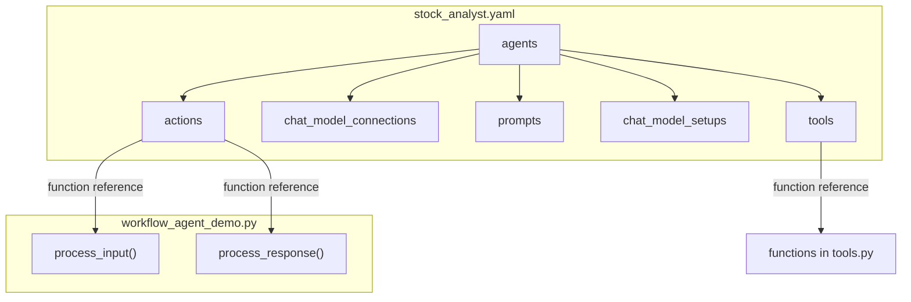
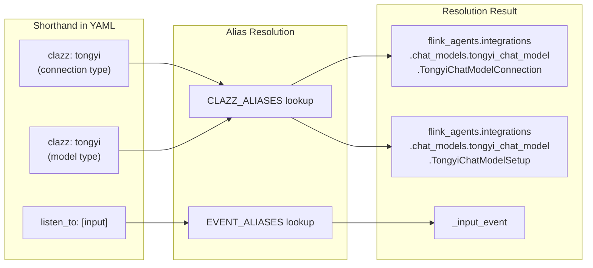
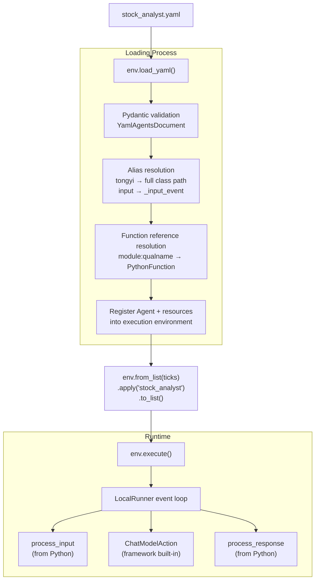

# Zero Python Resource Definition: Flink Agents YAML Declarative Configuration in Action

> This article is the fourth (and final) installment of the "Building an Intelligent Stock Trading System with Flink Agents" series. [Part 1](article-1-principles.md) introduced the framework's principles, [Part 2](article-2-react-agent.md) and [Part 3](article-3-workflow-agent.md) demonstrated the ReAct and Workflow agent modes respectively. This final part migrates all resource declarations of the Workflow Agent into a YAML file, showcasing the declarative configuration development experience.

---

## 1. Why YAML Declarative Configuration

In the Workflow Agent from the previous article, the Agent class contained two categories of code: resource declarations (connections, prompts, tools, model configurations) and event handling logic (`process_input` and `process_response`). These two categories differ in change frequency and the roles responsible for them.

Resource declarations change frequently and have a low barrier to entry. Operations staff may need to switch the LLM service connection address, data analysts might want to adjust the model's temperature parameter or swap prompts, and product managers may request adding or removing tools available to the Agent. These changes are essentially "configuration adjustments" that don't require understanding the full context of Python code.

Event handling logic, on the other hand, is relatively stable. The flow of `process_input` parsing tick data, manipulating memory, and initiating LLM calls, as well as `process_response` distinguishing phases and passing context, rarely changes once the Agent architecture is established.

The design philosophy behind YAML declarative configuration is to separate these two categories: **the YAML file handles resource declarations, while Python code retains only the processing logic**. This way, configuration changes don't require touching Python source files, lowering collaboration barriers and reducing the risk of unintended modifications.

---

## 2. YAML File Structure

`stock_analyst.yaml` is the core of this Demo. It fully defines all resources for an Agent—connections, prompts, tools, model configurations, and Action bindings—without writing a single line of Python resource declaration code.

```yaml
agents:
  - name: stock_analyst
    description: YAML declarative stock analysis Agent.

    actions:
      - name: process_input
        function: workflow_agent_demo:StockTradingAgent.process_input
        listen_to: [input]
      - name: process_response
        function: workflow_agent_demo:StockTradingAgent.process_response
        listen_to: [chat_response]

    chat_model_connections:
      - name: tongyi_conn
        clazz: tongyi

    prompts:
      - name: technical_prompt
        messages:
          - role: system
            content: |
              You are a stock technical analyst. Based on the incoming market data,
              use the available tools to calculate technical indicators, then provide
              a technical analysis conclusion.
          - role: user
            content: "Please analyze the following market data:\n{input}"
      - name: decision_prompt
        messages:
          - role: system
            content: |
              You are a trading decision expert. Based on the technical analysis results
              and current holdings, make a final trading decision. If you decide to trade,
              use the execute_trade tool to execute it.
          - role: user
            content: |
              Technical Analysis Results: {technical_analysis}
              Current Holdings: {portfolio}
              Current Market Data: {tick}

    chat_model_setups:
      - name: technical_model
        clazz: tongyi
        connection: tongyi_conn
        model: qwen-plus
        prompt: technical_prompt
        tools: [calculate_rsi, calculate_macd, check_portfolio]
      - name: decision_model
        clazz: tongyi
        connection: tongyi_conn
        model: qwen-plus
        prompt: decision_prompt
        tools: [execute_trade]

    tools:
      - name: calculate_rsi
        function: tools:calculate_rsi
      - name: calculate_macd
        function: tools:calculate_macd
      - name: check_portfolio
        function: tools:check_portfolio
      - name: execute_trade
        function: tools:execute_trade
```

This YAML file is semantically equivalent to the Python code in Demo 2. Let's compare: the Tongyi Qianwen connection declared via the `@chat_model_connection` decorator in Demo 2 becomes an entry under the `chat_model_connections` section in YAML. The dual-model configuration declared via `@chat_model_setup` in Demo 2 becomes two entries under the `chat_model_setups` section in YAML. The four tool functions wrapped by `@tool` decorators in Demo 2 become four function references under the `tools` section in YAML.



---

## 3. Alias System

The YAML file contains several values that appear to be "shorthand": `clazz: tongyi`, `listen_to: [input]`, `listen_to: [chat_response]`. These are not arbitrary abbreviations—they are part of the framework's **alias system**.

When the YAML loader encounters `clazz: tongyi`, it looks up the internal alias table (`CLAZZ_ALIASES`) and resolves it to the full class path based on the current resource type and language. For a `CHAT_MODEL_CONNECTION` type Python resource, `tongyi` resolves to `flink_agents.integrations.chat_models.tongyi_chat_model.TongyiChatModelConnection`. For a `CHAT_MODEL` type (i.e., the `chat_model_setups` section), the same `tongyi` resolves to the corresponding Setup class path.

Event types also have aliases. `listen_to: [input]` resolves to `["_input_event"]`, and `listen_to: [chat_response]` resolves to `["_chat_response_event"]`. This alias set includes eight entries: `input`, `output`, `chat_request`, `chat_response`, `tool_request`, `tool_response`, `context_retrieval_request`, and `context_retrieval_response`.



The alias system makes YAML configuration concise and readable. Users don't need to know the framework's internal class path structure—they only need to remember short names like `tongyi`, `openai`, or `ollama`. If the framework's internal package structure is refactored in the future, only the alias mapping table needs to be updated; existing YAML configuration files require no changes.

---

## 4. Function References

The `function` field in YAML uses the `module:qualname` format to reference functions or methods in Python code. This format is split into two parts by a colon: the part before the colon is the Python module name, and the part after is the qualified name within the module (which can include class names).

Taking `workflow_agent_demo:StockTradingAgent.process_input` as an example. The framework first calls `importlib.import_module()` on `workflow_agent_demo` to load the module, then traverses the dot-separated path to retrieve attributes step by step—first getting the `StockTradingAgent` class, then the `process_input` method. The result is a callable object, which the framework wraps as a `PythonFunction` for Action registration.

Tool function references are even simpler: `tools:calculate_rsi` means importing the `calculate_rsi` function from the `tools` module (i.e., `tools.py`). Note that the module name here is not a full package path, but a module name relative to `sys.path`—this requires that the current directory (or the directory containing the YAML file) must be in Python's module search path at runtime.

In `yaml_agent_demo.py`, there is a line that handles this exact issue:

```python
current_dir = str(Path(__file__).parent)
if current_dir not in sys.path:
    sys.path.insert(0, current_dir)
```

This ensures that the module names `tools` and `workflow_agent_demo` can be correctly resolved. Without this line, Python might search for these modules in other paths, resulting in a `ModuleNotFoundError`.

---

## 5. Loading and Execution

The code for loading and executing a YAML Agent is extremely concise—the entire `yaml_agent_demo.py` has fewer than 30 lines of effective code.

```python
from data_source import generate_stock_ticks, parse_args, set_source

args = parse_args()
set_source(args.source)

env = AgentsExecutionEnvironment.get_execution_environment()

# Load YAML Agent definition
yaml_path = str(Path(__file__).parent / "stock_analyst.yaml")
env.load_yaml(yaml_path)

# Generate market data (simulated or real)
symbols = args.symbols or ["GOOGL"]
input_list = generate_stock_ticks(symbols, num_ticks=1)

# Reference and execute by Agent name
output_list = env.from_list(input_list).apply("stock_analyst").to_list()
env.execute()
```

The internal processing of `env.load_yaml()` can be divided into several stages. First, it reads the YAML file and validates the structure using the Pydantic model `YamlAgentsDocument`. Then it resolves aliases—replacing `clazz: tongyi` with the full class path and `listen_to: [input]` with `["_input_event"]`. Next, it resolves function references—converting `tools:calculate_rsi` into an actual `PythonFunction` object. Finally, it registers the resolved Agent, resources, and Actions into the execution environment.

Note the `apply("stock_analyst")` call: unlike Demo 1 and Demo 2 which pass an Agent instance, here it passes a **string name**. The framework looks up this name in the registered Agent list—it corresponds to the value of `agents[0].name` in the YAML file.



The runtime behavior is identical to Demo 2—the same two-stage processing chain, the same tool invocation flow, and the same event propagation logic. The only difference is the way resources are defined: Python decorators are replaced by YAML configuration.

---

## 6. Results Interpretation

The Demo supports two execution modes:

```bash
python yaml_agent_demo.py                                    # Simulated data (default)
python yaml_agent_demo.py --source real --symbols GOOGL      # Real US stock data
```

In **simulated data mode**, the analysis of GOOGL (price 174.24) demonstrates the complete two-stage processing.

During the technical analysis phase, `technical_model` invoked three tools: RSI, MACD, and portfolio query. The RSI was 63.86 (neutral-to-strong, not overbought), the MACD showed a golden cross pattern (MACD line above signal line, histogram positive), and there were no current holdings. The verdict was "moderately bullish, suitable for dip-buying opportunities."

Entering the decision phase, `decision_model` made a more aggressive decision than in Demo 2—it directly called the `execute_trade` tool to buy 100 shares of GOOGL at $174.24. This was because GOOGL was currently at zero position (no holding risk), and the technical indicators showed clear bullish signals (RSI not overbought + MACD golden cross), leading the model to judge it as a good entry opportunity.

In **real data mode** (`--source real --symbols GOOGL`), the Agent uses AKShare to fetch the latest daily data for Google. The analysis process is identical to simulated data—the same two-stage processing chain, the same tool invocations—the only difference being that the input market data and historical prices come from real markets. This validates the seamless compatibility between YAML declarative configuration and Python processing logic when switching data sources.

Different technical signals indeed drove different trading decisions. This result forms an interesting contrast with Demo 2, where AAPL (RSI overbought, choose to hold) and TSLA (MACD death cross, choose to hold) were analyzed. Although the three Demos used different Agent definition approaches (ReAct configuration, Workflow decorators, YAML declarative), the LLM's reasoning quality and tool invocation behavior remained consistent—validating that the three definition modes are fully equivalent at runtime.

---

## 7. YAML vs Python Comparison

Each definition approach has its own applicable scenarios.

The advantage of YAML declarative configuration lies in **separation of configuration and logic**. When you need to frequently adjust model parameters (switching models, changing temperature), modify prompt content, or add or remove tools from the list, you only need to edit the YAML file without understanding or touching the Python source code. This is highly friendly for multi-role collaboration (developers write logic, operations adjust configuration, analysts modify prompts). YAML files also naturally support version control and diff comparison—a prompt modification is immediately visible in a git diff.

The advantage of the Python decorator approach lies in **type safety and IDE support**. All resource declarations are Python code with type annotations, allowing IDEs to provide autocomplete and error checking. The decorator approach also supports dynamic computation—for example, selecting different models based on environment variables, or using closures in tool functions to capture external state. These logic patterns cannot be expressed in pure YAML.

In practice, the two approaches can be used together. The Agent's skeleton logic (Action methods) is written in Python, while stable resource declarations (connections, prompts, tools, model configurations) are placed in YAML. This is exactly what Demo 3 does: YAML references the `process_input` and `process_response` methods from Python, but resource declarations are entirely handled in YAML.

---

## 8. Series Summary

Four articles have covered the complete path from principles to practice with Flink Agents. [Part 1](article-1-principles.md) dissected the framework's core design—three-layer architecture, event-driven model, lazy resource instantiation, three-tier memory, tool metadata extraction, compilation and execution flow—and provided a systematic comparison with mainstream frameworks like LangChain, CrewAI, and AutoGen. [Part 2](article-2-react-agent.md) demonstrated the "zero event orchestration" experience of a ReAct Agent in 60 lines of code—with the LLM autonomously driving tool invocations and outputting structured decisions. [Part 3](article-3-workflow-agent.md) built a dual-model, two-stage Workflow Agent, comprehensively utilizing the full decorator suite, memory system, and Skills. This final part migrated resource declarations from Python to YAML, showcasing the simplicity and flexibility of declarative configuration. All three Demos support one-click switching between simulated data and real AKShare market data through the data source proxy layer (`data_source.py`), with zero modifications required to the Agent core code.

The coverage of framework capabilities across the three Demos is as follows:

| Capability | Demo 1 (ReAct) | Demo 2 (Workflow) | Demo 3 (YAML) |
|------|:-:|:-:|:-:|
| ReAct Agent Mode | **✓** | | |
| Workflow Agent Mode | | **✓** | |
| @tool Tool System | **✓** (Environment-level) | **✓** (Decorator) | **✓** (YAML) |
| @prompt Prompts | **✓** | **✓** | **✓** |
| @chat_model_setup | | **✓** (Dual-model) | **✓** (Dual-model) |
| Short-term Memory | | **✓** | **✓** |
| Structured Output | **✓** | | |
| YAML Declarative | | | **✓** |
| Skills System | | **✓** | |
| Multi-step Event Chain | | **✓** | **✓** |
| Real Market Data | **✓** | **✓** | **✓** |

All Demos in this series run in local mode (`LocalRunner`) using the `from_list().apply().to_list()` debug pattern. To deploy them on a production Flink cluster, simply switch the data source from `from_list()` to `from_datastream()` (e.g., reading a real-time market data stream from Kafka) and specify a `key_selector` for the input data (e.g., `lambda x: x.symbol`). The Agent code itself requires no modifications—this is Flink Agents' core promise: "write once, run in two modes."

```python
from pyflink.datastream import StreamExecutionEnvironment
flink_env = StreamExecutionEnvironment.get_execution_environment()
agents_env = AgentsExecutionEnvironment.get_execution_environment(flink_env)

result_stream = (
    agents_env
    .from_datastream(input=tick_stream, key_selector=lambda x: x.symbol)
    .apply(agent)  # Same Agent, no modifications needed
    .to_datastream()
)
agents_env.execute("Stock Trading Job")
```

**Project Link**: [https://github.com/apache/flink-agents](https://github.com/apache/flink-agents)