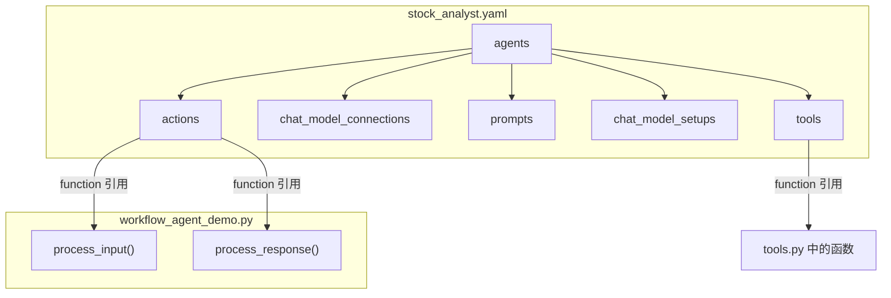
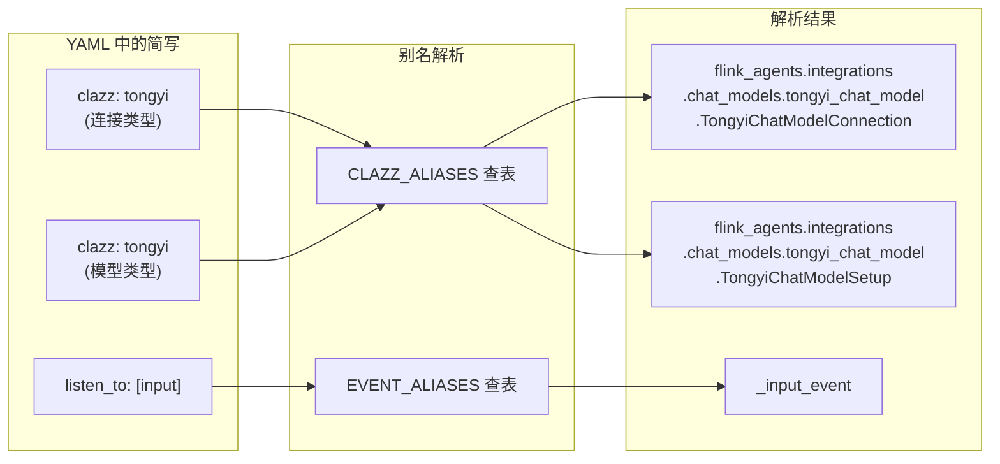
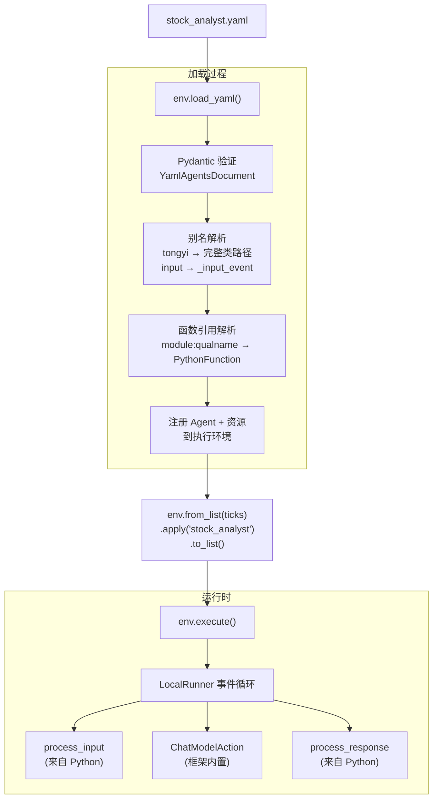

# 零 Python 资源定义：Flink Agents YAML 声明式配置实战

> 本文是"基于 Flink Agents 构建智能股票交易系统"系列的第四篇（终篇）。[第一篇](article-1-principles.zh.md)介绍了框架原理，[第二篇](article-2-react-agent.zh.md)和[第三篇](article-3-workflow-agent.zh.md)分别展示了 ReAct 和 Workflow 两种 Agent 模式。本篇将把 Workflow Agent 的全部资源声明迁移到 YAML 文件中，展示声明式配置的开发体验。

---

## 一、为什么需要 YAML 声明式

在上一篇的 Workflow Agent 中，Agent 类包含了两类代码：一类是资源声明（连接、prompt、工具、模型配置），另一类是事件处理逻辑（`process_input` 和 `process_response`）。这两类代码的变更频率和变更角色通常不同。

资源声明变更频繁且门槛低。运维人员可能需要切换 LLM 服务的连接地址，数据分析师可能想调整模型的温度参数或更换 prompt，产品经理可能要求增减 Agent 可用的工具。这些变更本质上是"配置调整"，不需要理解 Python 代码的完整上下文。

事件处理逻辑则相对稳定。`process_input` 解析 tick 数据、操作记忆、发起 LLM 调用的流程，以及 `process_response` 区分阶段、传递上下文的逻辑，在 Agent 架构确定后很少变动。

YAML 声明式配置的设计思路就是将这两类代码分离：**YAML 文件负责资源声明，Python 代码只保留处理逻辑**。这样，配置变更不需要触碰 Python 源文件，降低了协作门槛和误改风险。

---

## 二、YAML 文件结构

`stock_analyst.yaml` 是这个 Demo 的核心。它完整定义了一个 Agent 的全部资源——连接、prompt、工具、模型配置和 Action 绑定——而不需要编写一行 Python 资源声明代码。

```yaml
agents:
  - name: stock_analyst
    description: YAML 声明式股票分析 Agent。

    actions:
      - name: process_input
        function: workflow_agent_demo:StockTradingAgent.process_input
        listen_to: [input]
      - name: process_response
        function: workflow_agent_demo:StockTradingAgent.process_response
        listen_to: [chat_response]

    chat_model_connections:
      - name: tongyi_conn
        clazz: tongyi

    prompts:
      - name: technical_prompt
        messages:
          - role: system
            content: |
              你是一位股票技术分析师。请根据输入的行情数据，
              使用可用的工具计算技术指标，然后给出技术面分析结论。
          - role: user
            content: "请分析以下行情数据:\n{input}"
      - name: decision_prompt
        messages:
          - role: system
            content: |
              你是一位交易决策专家。根据技术分析结果和当前持仓，
              做出最终的交易决策。如果决定交易，使用 execute_trade 工具执行。
          - role: user
            content: |
              技术分析结果: {technical_analysis}
              当前持仓: {portfolio}
              当前行情: {tick}

    chat_model_setups:
      - name: technical_model
        clazz: tongyi
        connection: tongyi_conn
        model: qwen-plus
        prompt: technical_prompt
        tools: [calculate_rsi, calculate_macd, check_portfolio]
      - name: decision_model
        clazz: tongyi
        connection: tongyi_conn
        model: qwen-plus
        prompt: decision_prompt
        tools: [execute_trade]

    tools:
      - name: calculate_rsi
        function: tools:calculate_rsi
      - name: calculate_macd
        function: tools:calculate_macd
      - name: check_portfolio
        function: tools:check_portfolio
      - name: execute_trade
        function: tools:execute_trade
```

这个 YAML 文件和 Demo 2 的 Python 代码在语义上是等价的。对比一下：Demo 2 中 `@chat_model_connection` 装饰器声明的通义千问连接，在 YAML 中变成了 `chat_model_connections` 段落下的一个条目。Demo 2 中 `@chat_model_setup` 声明的双模型配置，在 YAML 中变成了 `chat_model_setups` 段落下的两个条目。Demo 2 中 `@tool` 装饰器包裹的四个工具函数，在 YAML 中变成了 `tools` 段落下的四个函数引用。



---

## 三、别名系统

YAML 文件中有几个看起来"简写"的值：`clazz: tongyi`、`listen_to: [input]`、`listen_to: [chat_response]`。这些并不是随意简写，而是框架提供的**别名系统**。

当 YAML 加载器遇到 `clazz: tongyi` 时，它会在内部的别名表（`CLAZZ_ALIASES`）中查找，根据当前资源类型和语言将其解析为完整的类路径。对于 `CHAT_MODEL_CONNECTION` 类型的 Python 资源，`tongyi` 被解析为 `flink_agents.integrations.chat_models.tongyi_chat_model.TongyiChatModelConnection`。对于 `CHAT_MODEL` 类型（即 `chat_model_setups` 段落），同样的 `tongyi` 被解析为对应的 Setup 类路径。

事件类型同样有别名。`listen_to: [input]` 被解析为 `["_input_event"]`，`listen_to: [chat_response]` 被解析为 `["_chat_response_event"]`。这组别名包括 `input`、`output`、`chat_request`、`chat_response`、`tool_request`、`tool_response`、`context_retrieval_request`、`context_retrieval_response` 八个。



别名系统的存在让 YAML 配置变得简洁可读。使用者不需要知道框架内部的类路径结构，只需记住 `tongyi`、`openai`、`ollama` 这样的短名称即可。如果将来框架重构了内部包结构，只要更新别名映射表，已有的 YAML 配置文件不需要任何修改。

---

## 四、函数引用

YAML 中的 `function` 字段使用 `module:qualname` 格式来引用 Python 代码中的函数或方法。这个格式由冒号分隔为两部分：冒号前是 Python 模块名，冒号后是模块内的限定名称（可以包含类名）。

以 `workflow_agent_demo:StockTradingAgent.process_input` 为例。框架首先对 `workflow_agent_demo` 执行 `importlib.import_module()` 加载模块，然后按点号路径逐层获取属性——先获取 `StockTradingAgent` 类，再获取 `process_input` 方法。最终得到的是一个可调用对象，框架将其封装为 `PythonFunction` 用于 Action 注册。

工具函数的引用更简单：`tools:calculate_rsi` 表示从 `tools` 模块（即 `tools.py`）导入 `calculate_rsi` 函数。注意这里的模块名不是完整的包路径，而是相对于 `sys.path` 的模块名——这就要求运行时当前目录（或 YAML 文件所在目录）必须在 Python 的模块搜索路径中。

在 `yaml_agent_demo.py` 中，有一行代码正是处理这个问题的：

```python
current_dir = str(Path(__file__).parent)
if current_dir not in sys.path:
    sys.path.insert(0, current_dir)
```

这确保了 `tools` 和 `workflow_agent_demo` 这两个模块名能被正确解析。如果不加这一行，Python 可能在其他路径下寻找这些模块而导致 `ModuleNotFoundError`。

---

## 五、加载与执行

YAML Agent 的加载和执行代码极其简洁——整个 `yaml_agent_demo.py` 只有不到 30 行有效代码。

```python
from data_source import generate_stock_ticks, parse_args, set_source

args = parse_args()
set_source(args.source)

env = AgentsExecutionEnvironment.get_execution_environment()

# 加载 YAML Agent 定义
yaml_path = str(Path(__file__).parent / "stock_analyst.yaml")
env.load_yaml(yaml_path)

# 生成行情数据（模拟或真实）
symbols = args.symbols or ["GOOGL"]
input_list = generate_stock_ticks(symbols, num_ticks=1)

# 用 Agent 名称引用并执行
output_list = env.from_list(input_list).apply("stock_analyst").to_list()
env.execute()
```

`env.load_yaml()` 的内部处理过程可以分为几个阶段。首先读取 YAML 文件并用 Pydantic 模型 `YamlAgentsDocument` 验证结构。然后解析别名——将 `clazz: tongyi` 替换为完整类路径，将 `listen_to: [input]` 替换为 `["_input_event"]`。接着解析函数引用——将 `tools:calculate_rsi` 解析为实际的 `PythonFunction` 对象。最后将解析完成的 Agent、资源和 Action 注册到执行环境中。

注意 `apply("stock_analyst")` 的调用方式：不像 Demo 1 和 Demo 2 传入一个 Agent 实例，这里传入的是一个**字符串名称**。框架会在已注册的 Agent 列表中查找这个名称——它对应的就是 YAML 文件中 `agents[0].name` 的值。



运行效果与 Demo 2 完全一致——同样的两阶段处理链、同样的工具调用流程、同样的事件流转逻辑。唯一的区别在于资源的定义方式：Python 装饰器换成了 YAML 配置。

---

## 六、运行结果解读

Demo 支持两种运行方式：

```bash
python yaml_agent_demo.py                                    # 模拟数据（默认）
python yaml_agent_demo.py --source real --symbols GOOGL      # 美股真实行情
```

**模拟数据模式**下，分析 GOOGL（价格 174.24）的结果展示了完整的两阶段处理。

技术分析阶段，`technical_model` 调用了 RSI、MACD 和持仓查询三个工具。RSI 为 63.86（中性偏强，未达超买），MACD 呈金叉形态（MACD 线高于信号线，柱状图为正），当前无持仓。综合判断为"温和看涨，适合关注低吸机会"。

进入决策阶段后，`decision_model` 做出了比 Demo 2 更激进的决策——它直接调用 `execute_trade` 工具以 $174.24 买入了 100 股 GOOGL。这是因为 GOOGL 当前空仓（无持仓风险），技术面呈明确看涨信号（RSI 未超买 + MACD 金叉），模型判断这是一个较好的建仓时机。

**真实行情模式**下（`--source real --symbols GOOGL`），Agent 使用 AKShare 获取谷歌的最新日线数据。分析过程与模拟数据完全一致——同样的两阶段处理链、同样的工具调用——唯一的区别是输入的行情数据和历史价格来自真实市场。这验证了 YAML 声明式配置和 Python 处理逻辑在切换数据源时的无缝兼容性。

不同的技术面信号确实驱动了不同的交易决策。这个结果与 Demo 2 中 AAPL（RSI 超买，选择持有）和 TSLA（MACD 死叉，选择持有）形成了有趣的对比。尽管三个 Demo 使用了不同的 Agent 定义方式（ReAct 配置式、Workflow 装饰器式、YAML 声明式），LLM 的推理质量和工具调用行为是一致的——这验证了框架的三种定义方式在运行时是完全等价的。

---

## 七、YAML vs Python 对比

两种定义方式各有适用场景。

YAML 声明式的优势在于**配置与逻辑分离**。当你需要频繁调整模型参数（换模型、改温度）、修改 prompt 内容、增减工具列表时，只需编辑 YAML 文件，无需理解或触碰 Python 源代码。这对于多角色协作（开发者写逻辑、运维调配置、分析师改 prompt）非常友好。YAML 文件还天然支持版本控制和差异对比——一个 prompt 的修改在 git diff 中一目了然。

Python 装饰器方式的优势在于**类型安全和 IDE 支持**。所有资源声明都是有类型注解的 Python 代码，IDE 可以提供自动补全和错误检查。装饰器方式还支持动态计算——比如根据环境变量选择不同的模型，或者在工具函数中使用闭包捕获外部状态。这些逻辑在纯 YAML 中无法表达。

在实践中，两种方式可以混合使用。Agent 的骨架逻辑（Action 方法）用 Python 编写，稳定不变的资源声明（连接、prompt、工具、模型配置）放在 YAML 中。这正是 Demo 3 的做法：YAML 引用了 Python 中的 `process_input` 和 `process_response` 方法，但资源声明完全在 YAML 中完成。

---

## 八、系列总结

四篇文章走完了 Flink Agents 从原理到实战的完整路径。[第一篇](article-1-principles.zh.md)拆解了框架的核心设计——三层架构、事件驱动模型、资源延迟实例化、三级记忆、工具元数据提取、编译执行流程，并与 LangChain/CrewAI/AutoGen 等主流框架进行了系统对比。[第二篇](article-2-react-agent.zh.md)用 60 行代码展示了 ReAct Agent 的"零事件编排"体验——LLM 自主驱动工具调用并输出结构化决策。[第三篇](article-3-workflow-agent.zh.md)构建了双模型两阶段的 Workflow Agent，综合运用了装饰器全家桶、记忆系统和 Skills。本篇将资源声明从 Python 迁移到 YAML，展示了声明式配置的简洁与灵活。三个 Demo 都通过数据源代理层（`data_source.py`）支持模拟数据和 AKShare 真实行情的一键切换，Agent 核心代码无需任何修改。

三个 Demo 对框架能力的覆盖如下：

| 能力 | Demo 1 (ReAct) | Demo 2 (Workflow) | Demo 3 (YAML) |
|------|:-:|:-:|:-:|
| ReAct Agent 模式 | **✓** | | |
| Workflow Agent 模式 | | **✓** | |
| @tool 工具系统 | **✓** (环境级) | **✓** (装饰器) | **✓** (YAML) |
| @prompt 提示词 | **✓** | **✓** | **✓** |
| @chat_model_setup | | **✓** (双模型) | **✓** (双模型) |
| 短期记忆 | | **✓** | **✓** |
| 结构化输出 | **✓** | | |
| YAML 声明式 | | | **✓** |
| Skills 技能系统 | | **✓** | |
| 多步骤事件链 | | **✓** | **✓** |
| 真实行情数据 | **✓** | **✓** | **✓** |

本系列的所有 Demo 都运行在本地模式（`LocalRunner`）下，使用 `from_list().apply().to_list()` 的调试模式。要将它们部署到生产环境的 Flink 集群上，只需将数据源从 `from_list()` 切换为 `from_datastream()`（如从 Kafka 读取实时行情流），并为输入数据指定一个 `key_selector`（如 `lambda x: x.symbol`）。Agent 代码本身不需要任何修改——这就是 Flink Agents "一次编写，两种模式运行"的核心承诺。

```python
from pyflink.datastream import StreamExecutionEnvironment
flink_env = StreamExecutionEnvironment.get_execution_environment()
agents_env = AgentsExecutionEnvironment.get_execution_environment(flink_env)

result_stream = (
    agents_env
    .from_datastream(input=tick_stream, key_selector=lambda x: x.symbol)
    .apply(agent)  # 同一个 Agent，无需修改
    .to_datastream()
)
agents_env.execute("Stock Trading Job")
```

**项目链接**：[github.com/apache/flink-agents](https://github.com/apache/flink-agents)
